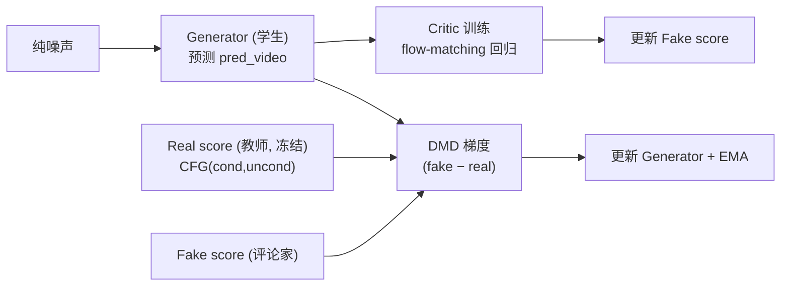

# Flashgen DMD 蒸馏算法实现细节

> 配套文档：本文专讲 **DMD（Distribution Matching Distillation，分布匹配蒸馏）** 的网络结构、前向与损失数学细节。训练流程框架（启动、继承链、`train_one_step` 交替优化、主循环）见《[架构设计](架构设计.md)》。
> 代码位置：`flashgen/training/distillation_pipeline.py`。

---

## 1. 三个网络

DMD 通过"真分数（real score）"与"假分数（fake score）"之差，把学生输出分布推向真实数据分布。训练涉及三个 DiT：

| 角色 | 字段 | 作用 | 是否更新 |
|------|------|------|----------|
| Generator（学生） | `transformer` | 少步生成，最终蒸馏产物 | ✅ 训练（含 EMA） |
| Real score（教师） | `real_score_transformer` | 预训练真分数模型，提供真实分布梯度 | ❌ 冻结 |
| Fake score（评论家） | `fake_score_transformer` | 实时拟合学生输出分布的分数 | ✅ 训练 |



> 三套 DiT 由 `DistillationPipeline.load_modules` 从 `real_score_model_path` / `fake_score_model_path` 显式加载；teacher 在 `initialize_training_pipeline` 中被 `requires_grad_(False) + eval()` 冻结。

---

## 2. 学生前向：单步与多步模拟

学生生成 `pred_video` 有两种方式，由 `simulate_generator_forward` 开关选择：

### 2.1 单步前向 `_generator_forward`

从干净 latent 随机取一个去噪步 `denoising_step_list[idx]`，加噪后让学生预测，再把噪声预测转成"干净视频"：

```527:548:flashgen/training/distillation_pipeline.py
    def _generator_forward(self, training_batch: TrainingBatch) -> torch.Tensor:

        latents = training_batch.latents
        dtype = latents.dtype
        index = torch.randint(0, len(self.denoising_step_list), [1], device=self.device, dtype=torch.long)
        timestep = self.denoising_step_list[index]
        training_batch.dmd_latent_vis_dict["generator_timestep"] = timestep

        noise = torch.randn(self.video_latent_shape, device=self.device, dtype=dtype)
        noisy_latent = self.noise_scheduler.add_noise(latents.flatten(0, 1), noise.flatten(0, 1),
                                                      timestep).unflatten(0, (latents.shape[0], latents.shape[1]))

        training_batch = self._build_distill_input_kwargs(noisy_latent, timestep, training_batch.conditional_dict,
                                                          training_batch)

        pred_noise = self.transformer(**training_batch.input_kwargs).permute(0, 2, 1, 3, 4)
        pred_video = pred_noise_to_pred_video(pred_noise=pred_noise.flatten(0, 1),
                                              noise_input_latent=noisy_latent.flatten(0, 1),
                                              timestep=timestep,
                                              scheduler=self.noise_scheduler).unflatten(0, pred_noise.shape[:2])

        return pred_video
```

### 2.2 多步模拟前向 `_generator_multi_step_simulation_forward`

更贴近少步推理：随机选一个目标步，从纯噪声出发用学生**逐步**走到目标步前（中间步在 `torch.no_grad()` 下"预测→按下一步加噪"循环），再在目标步做一次需训练的预测。这样训练分布与推理时的多步采样一致。

> 两种方式都依赖 `pred_noise_to_pred_video`（`flashgen/models/utils.py`）把流匹配的噪声预测转换为干净视频估计。

---

## 3. DMD 损失（generator 更新）

学生产出 `pred_video` 后，在随机时间步上让 real/fake 两个分数网络分别对其加噪结果打分，用二者之差构造梯度，反传给 generator：

```673:694:flashgen/training/distillation_pipeline.py
            # CFG on the real-score teacher. Uses the DMD2 parameterization
            # x_cond + w * (x_cond - x_uncond), which is offset by 1 from the
            # Ho & Salimans form x_uncond + w * (x_cond - x_uncond):
            # w=0 -> cond, w=-1 -> uncond, w_standard = w + 1.
            real_score_pred_video = pred_real_video_cond + (pred_real_video_cond -
                                                            pred_real_video_uncond) * self.real_score_guidance_scale

            grad = (faker_score_pred_video - real_score_pred_video) / torch.abs(original_latent -
                                                                                real_score_pred_video).mean()
            grad = torch.nan_to_num(grad)

        dmd_loss = 0.5 * F.mse_loss(original_latent.float(), (original_latent.float() - grad.float()).detach())
```

要点：

- **教师 CFG（DMD2 参数化）**：`real_score_pred_video = x_cond + w·(x_cond − x_uncond)`，其中 `w = real_score_guidance_scale`（默认 3.5）。该式与 Ho & Salimans 形式 `x_uncond + w·(x_cond − x_uncond)` 相差常数 1（`w_standard = w + 1`）。
- **梯度**：`grad = (fake − real) / |orig − real|.mean()`，再 `nan_to_num` 稳定数值。
- **损失形式**：`dmd_loss = 0.5 · MSE(x0, (x0 − grad).detach())`。整个分数计算在 `torch.no_grad()` 下，梯度仅通过这个 MSE 的"伪目标"回传给 generator（即把 `grad` 当作 generator 输出应当下降的方向）。

---

## 4. Flow-matching 损失（fake score / critic 更新）

评论家要持续"追上"学生当前的输出分布，对学生输出加噪后做标准 flow-matching 回归：

```696:728:flashgen/training/distillation_pipeline.py
    def faker_score_forward(self, training_batch: TrainingBatch) -> tuple[TrainingBatch, torch.Tensor]:
        with torch.no_grad(), set_forward_context(current_timestep=training_batch.timesteps,
                                                  attn_metadata=training_batch.attn_metadata):
            if self.training_args.simulate_generator_forward:
                generator_pred_video = self._generator_multi_step_simulation_forward(training_batch)
            else:
                generator_pred_video = self._generator_forward(training_batch)

        fake_score_timestep = torch.randint(0, self.num_train_timestep, [1], device=self.device, dtype=torch.long)
        ...
        noisy_generator_pred_video = self.noise_scheduler.add_noise(generator_pred_video.flatten(0, 1),
                                                                    fake_score_noise.flatten(0, 1),
                                                                    fake_score_timestep).unflatten(
                                                                        0, (generator_pred_video.shape[0], generator_pred_video.shape[1]))
        ...
        target = fake_score_noise - generator_pred_video
        flow_matching_loss = torch.mean((fake_score_pred_noise - target)**2)
```

要点：

- 学生前向在 `torch.no_grad()` 下产出 `generator_pred_video`（critic 训练不更新学生）。
- 在随机时间步加噪后，critic 预测噪声，回归目标为流匹配速度场 `noise − x0`。
- `flow_matching_loss = MSE(fake_score_pred_noise, noise − x0)`。critic 越准，第 3 节里它给出的"假分数"越能代表学生当前分布。

---

## 5. 关键超参

| 超参 | 字段（`TrainingArgs`） | 默认 | 作用 |
|------|------------------------|------|------|
| 真分数 CFG 强度 | `real_score_guidance_scale` | 3.5 | 教师 CFG 的 `w`，越大越偏条件分布 |
| generator 更新间隔 | `generator_update_interval` | 5 | 每多少步更新一次 generator（critic 每步更新） |
| 时间步范围下界 | `min_timestep_ratio` | 0.02 | DMD/critic 采样时间步的下限比例 |
| 时间步范围上界 | `max_timestep_ratio` | 0.98 | 上限比例 |
| 学生前向模式 | `simulate_generator_forward` | False | True 用多步模拟，False 用单步 |
| EMA 衰减 / 起始 | `ema_decay` / `ema_start_step` | 0 / 0 | generator 权重 EMA |
| 蒸馏步表 | `dmd_denoising_steps` | `[1000,757,522]` | 学生少步去噪用的时间步列表 |

时间步还会经 `shift_timestep(t, timestep_shift, num_train_timestep)` 做 flow-shift 变换（`timestep_shift = pipeline_config.flow_shift`），并 clamp 到 `[min_timestep, max_timestep]`。

---

*本文档基于源码静态分析生成，关键代码位置均以 `路径:行号` 标注。算法之外的训练流程、分布式与配置体系见《[架构设计](架构设计.md)》。*
