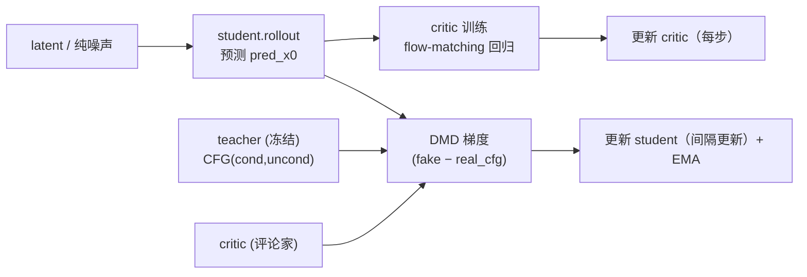

# Flashgen DMD2 蒸馏算法实现细节

> 配套文档：本文专讲 **DMD2（Distribution Matching Distillation，分布匹配蒸馏）** 的网络结构、前向 rollout 与损失的数学细节。训练流程框架（启动、组装、`Trainer` 循环、交替优化编排）见《[架构设计](架构设计.md)》。
> 代码位置：算法在 `flashgen/train/methods/distribution_matching/dmd2.py`（`DMD2Method`）；前向原语在 `flashgen/train/models/wan/wan.py`（`WanModel`）与 `flashgen/train/models/base.py`（`ModelBase`）。

---

## 1. 三个网络（三个独立模型实例）

DMD2 通过「真分数（real score）」与「假分数（fake score）」之差，把学生输出分布推向真实数据分布。新栈里三个网络**各是一个独立的 `WanModel` 实例**（而非旧栈里一个 pipeline 持有三套 transformer），由 YAML 的 `models.{student,teacher,critic}` 分别声明、`DMD2Method.__init__` 从 `role_models` 取用：

| 角色 | `role_models` 键 | 作用 | 是否可训练 |
|------|------------------|------|------------|
| Generator（学生） | `student` | 少步生成，最终蒸馏产物 | ✅ 训练（EMA 由回调管理） |
| Real score（教师） | `teacher` | 预训练真分数模型，提供真实分布梯度 | ❌ 冻结（`trainable: false`） |
| Fake score（评论家） | `critic` | 实时拟合学生输出分布的分数 | ✅ 训练 |



`DMD2Method` 构造时做严格校验：必须有 `student/teacher/critic` 三个角色，且 `student`、`critic` 可训练、`teacher` 冻结，否则报错：

```39:55:flashgen/train/methods/distribution_matching/dmd2.py
        if "student" not in role_models:
            raise ValueError("DMD2Method requires role 'student'")
        if "teacher" not in role_models:
            raise ValueError("DMD2Method requires role 'teacher'")
        if "critic" not in role_models:
            raise ValueError("DMD2Method requires role 'critic'")

        self.teacher = role_models["teacher"]
        self.critic = role_models["critic"]

        if not self.student._trainable:
            raise ValueError("DMD2Method requires student to be trainable")
        if self.teacher._trainable:
            raise ValueError("DMD2Method requires teacher to be "
                             "non-trainable")
        if not self.critic._trainable:
            raise ValueError("DMD2Method requires critic to be trainable")
```

---

## 2. 学生 rollout：单步与多步模拟

学生产出 `pred_x0` 有两种方式，由 `method.rollout_mode` 选择（见 `_student_rollout`）。两者都通过 `ModelBase.predict_x0` 完成「预测噪声 → 转干净视频」的组合（`predict_noise` + `pred_noise_to_pred_video`）。

### 2.1 data_latent（单步）

从预处理 VAE latent 出发，随机取一个去噪步 `dmd_denoising_steps[idx]`，加噪后让学生单步预测、转回 `x0`：

```436:454:flashgen/train/methods/distribution_matching/dmd2.py
        if self._rollout_mode != "simulate":
            timestep = self._sample_rollout_timestep(device)
            noise = torch.randn(
                latents.shape,
                device=device,
                dtype=dtype,
                generator=self.cuda_generator,
            )
            noisy_latents = self.student.add_noise(latents, noise, timestep)
            pred_x0 = self.student.predict_x0(
                noisy_latents,
                timestep,
                batch,
                conditional=True,
                cfg_uncond=self._cfg_uncond,
                attn_kind="vsa",
            )
            batch.dmd_latent_vis_dict["generator_timestep"] = timestep
            return pred_x0
```

### 2.2 simulate（多步模拟）

更贴近少步推理：随机选一个目标步，从纯噪声出发用学生**逐步**走到目标步前（中间步在 `torch.no_grad()` 下「预测 → 按下一步加噪」循环），再在目标步做一次需训练的预测。这样训练分布与推理时的多步采样一致，且可配合 `text_only` 数据（起点 latent 用 `zeros`）。

> `attn_kind="vsa"` 是接口保留参数；在 NPU 上 `WanModel` 已把 VSA 元数据置空、实际走 dense SDPA，因此 vsa/dense 都落到同一 SDPA 前向。

---

## 3. DMD 损失（generator 更新）

学生产出 `generator_pred_x0` 后，在随机时间步上让 critic（假分数）与 teacher（真分数，带 CFG）分别对其加噪结果打分，用二者之差构造梯度回传给 student：

```636:662:flashgen/train/methods/distribution_matching/dmd2.py
            real_cond_x0 = self.teacher.predict_x0(
                noisy_latents,
                timestep,
                batch,
                conditional=True,
                cfg_uncond=self._cfg_uncond,
                attn_kind="dense",
            )
            real_uncond_x0 = self.teacher.predict_x0(
                noisy_latents,
                timestep,
                batch,
                conditional=False,
                cfg_uncond=self._cfg_uncond,
                attn_kind="dense",
            )
            real_cfg_x0 = real_cond_x0 + (real_cond_x0 - real_uncond_x0) * guidance_scale

            denom = torch.abs(generator_pred_x0 - real_cfg_x0).mean()
            grad = (faker_x0 - real_cfg_x0) / denom
            grad = torch.nan_to_num(grad)

        loss = 0.5 * F.mse_loss(
            generator_pred_x0.float(),
            (generator_pred_x0.float() - grad.float()).detach(),
        )
        return loss
```

要点：

- **教师 CFG（DMD2 参数化）**：`real_cfg_x0 = x_cond + w·(x_cond − x_uncond)`，其中 `w = real_score_guidance_scale`（YAML 默认 3.5，代码缺省 1.0）。该式与 Ho & Salimans 形式 `x_uncond + w·(x_cond − x_uncond)` 相差常数 1。这是 FlashGen 刻意保留、区别于上游的参数化。
- **假分数**：`faker_x0 = critic.predict_x0(...)`，代表学生当前分布下的分数。
- **梯度**：`grad = (faker_x0 − real_cfg_x0) / |generator_pred_x0 − real_cfg_x0|.mean()`，再 `nan_to_num` 稳定数值。
- **损失形式**：`dmd_loss = 0.5 · MSE(x0, (x0 − grad).detach())`。整个分数计算在 `torch.no_grad()` 下，梯度仅通过这个 MSE 的「伪目标」回传给 student（把 `grad` 当作 student 输出应下降的方向）。
- **时间步**：`timestep` 采样后经 `student.shift_and_clamp_timestep` 做 flow-shift 变换并 clamp 到 `[min_timestep, max_timestep]`。

---

## 4. Flow-matching 损失（fake score / critic 更新）

评论家要持续「追上」学生当前的输出分布：对学生输出（`no_grad` 下产出）加噪后做标准 flow-matching 回归：

```547:582:flashgen/train/methods/distribution_matching/dmd2.py
    def _critic_flow_matching_loss(
        self,
        batch: Any,
    ) -> tuple[torch.Tensor, Any, dict[str, Any]]:
        with torch.no_grad():
            generator_pred_x0 = self._student_rollout(batch, with_grad=False)

        device = generator_pred_x0.device
        fake_score_timestep = torch.randint(
            0,
            int(self.student.num_train_timesteps),
            [1],
            device=device,
            dtype=torch.long,
            generator=self.cuda_generator,
        )
        fake_score_timestep = (self.student.shift_and_clamp_timestep(fake_score_timestep))

        noise = torch.randn(
            generator_pred_x0.shape,
            device=device,
            dtype=generator_pred_x0.dtype,
            generator=self.cuda_generator,
        )
        noisy_x0 = self.student.add_noise(generator_pred_x0, noise, fake_score_timestep)

        pred_noise = self.critic.predict_noise(
            noisy_x0,
            fake_score_timestep,
            batch,
            conditional=True,
            cfg_uncond=self._cfg_uncond,
            attn_kind="dense",
        )
        target = noise - generator_pred_x0
        flow_matching_loss = torch.mean((pred_noise - target)**2)
```

要点：

- 学生前向在 `torch.no_grad()` 下产出 `generator_pred_x0`（critic 训练不更新学生）。
- 在随机时间步（同样 `shift_and_clamp`）加噪后，critic 预测噪声，回归目标为流匹配速度场 `noise − x0`。
- `flow_matching_loss = MSE(critic_pred_noise, noise − x0)`。critic 越准，第 3 节里它给出的「假分数」越能代表学生当前分布。

---

## 5. 交替优化与角色化 backward

DMD2 覆盖了 `TrainingMethod` 的 `backward` / `get_optimizers` / `get_lr_schedulers` / `get_grad_clip_targets`，实现「critic 每步、student 间隔更新」的交替节奏。`single_train_step` 把两条 backward 的上下文塞进 `outputs["_fv_backward"]`，由 method 的 `backward` 按角色分别回传：

```140:175:flashgen/train/methods/distribution_matching/dmd2.py
    def backward(
        self,
        loss_map: dict[str, torch.Tensor],
        outputs: dict[str, Any],
        *,
        grad_accum_rounds: int = 1,
    ) -> None:
        grad_accum_rounds = max(1, int(grad_accum_rounds))
        backward_ctx = outputs.get("_fv_backward")
        if not isinstance(backward_ctx, dict):
            super().backward(
                loss_map,
                outputs,
                grad_accum_rounds=grad_accum_rounds,
            )
            return

        update_student = bool(backward_ctx.get("update_student", False))
        if update_student:
            student_ctx = backward_ctx.get("student_ctx")
            if student_ctx is None:
                raise RuntimeError("Missing student backward context")
            self.student.backward(
                loss_map["generator_loss"],
                student_ctx,
                grad_accum_rounds=grad_accum_rounds,
            )

        critic_ctx = backward_ctx.get("critic_ctx")
        if critic_ctx is None:
            raise RuntimeError("Missing critic backward context")
        self.critic.backward(
            loss_map["fake_score_loss"],
            critic_ctx,
            grad_accum_rounds=grad_accum_rounds,
        )
```

- `ModelBase.backward` 在正确的 `set_forward_context`（timesteps + attn_metadata）下对各自的 loss 调用 `.backward()`，保证前向上下文与反向一致。
- `Trainer` 随后调用 `method.optimizers_schedulers_step(step)`；由于 `get_optimizers(step)` 在非更新步只返回 critic 优化器，student 的参数在这些步不被 step。
- EMA 不在算法内部：`EMACallback.on_training_step_end` 在每步优化器步进后更新 student 的 EMA 影子权重（`EMA_FSDP`）。

---

## 6. 关键超参

| 超参 | 配置位置 | 默认（YAML） | 作用 |
|------|----------|--------------|------|
| 真分数 CFG 强度 | `method.real_score_guidance_scale` | 3.5 | 教师 CFG 的 `w`，越大越偏条件分布 |
| generator 更新间隔 | `method.generator_update_interval` | 5 | 每多少步更新一次 student（critic 每步更新） |
| rollout 模式 | `method.rollout_mode` | data_latent | `data_latent` 单步 / `simulate` 多步模拟 |
| 蒸馏步表 | `method.dmd_denoising_steps` | `[1000,757,522]` | 学生少步去噪用的时间步列表 |
| warp 时间步 | `method.warp_denoising_step` | false | 是否按 scheduler.timesteps 重映射步表 |
| critic 学习率 | `method.fake_score_learning_rate` | 0.0→回退 student lr | 0/未设时回退到 `training.optimizer.learning_rate` |
| critic betas / 调度 | `method.fake_score_betas` / `_lr_scheduler` | 回退 student | 同上，未设时回退到 student 优化器配置 |
| 时间步范围 | `training.model.min/max_timestep_ratio` | 0.02 / 0.98 | `shift_and_clamp_timestep` 的 clamp 区间比例 |
| 采样权重方案 | `training.model.weighting_scheme` | uniform | `_sample_timesteps` 的密度采样方案 |
| EMA 衰减 / 起始 | `callbacks.ema.decay` / `start_iter` | 回调声明 | student 权重 EMA（由 `EMACallback` 管理） |

- **critic 优化器回退**（`_init_optimizers_and_schedulers`）：`fake_score_*` 为 0/未设时回退 student 对应值——FlashGen 刻意保留，区别于上游强制报错的行为。
- **共享 RNG**：所有 `torch.randn` / `torch.randint` 都用 method 的 `cuda_generator`（NPU 设备生成器，SP 组内同种子），保证可复现与并行一致性。

---

*本文档基于源码静态分析生成，关键代码位置均以 `路径:行号` 标注。算法之外的训练流程、分布式与配置体系见《[架构设计](架构设计.md)》。*
