# Flashgen 架构设计文档（训练库 / Train-Only）

> 版本：基于当前代码库快照（Wan 2.1 1.3B DMD 步数蒸馏，NPU/昇腾专用分支）
> 文档定位：Flashgen 现已收敛为**只做训练的步数蒸馏算法库**——推理由其他库承担。本文结合源码，系统讲解其分层架构、训练生命周期、DMD 蒸馏数据流，以及拓展新蒸馏算法的扩展点。

---

## 1. 项目概述

**Flashgen** 是一个**面向 NPU（昇腾）的步数蒸馏（few-step distillation）训练库**。它不包含任何推理服务/CLI 生成/Worker 编排栈，只保留把多步扩散模型蒸馏成少步学生模型所需的训练能力。当前内置算法为 **DMD（Distribution Matching Distillation，分布匹配蒸馏）**，目标模型族为 `Wan 2.1 1.3B` 文生视频（T2V）。

设计上的几个硬约束（来自代码）：

| 维度 | 取值 | 代码依据 |
|------|------|----------|
| 库定位 | 仅训练，无推理 | `pipelines/__init__.py` 注释 "Train-only pipeline primitives" |
| 内置算法 | DMD 三网络蒸馏 | `training/distillation_pipeline.py` |
| 目标模型 | Wan 2.1 1.3B T2V | `WanDistillationPipeline` + `FastWan2_1_T2V_480P_Config` |
| 目标硬件 | NPU（昇腾，HCCL 通信） | `platforms/npu.py` |
| 注意力后端 | 仅 `TORCH_SDPA` | `platforms/npu.py::get_attn_backend_cls` |
| 蒸馏步数 | `[1000, 757, 522]`（默认 3 步） | `FastWan2_1_T2V_480P_Config.dmd_denoising_steps` |
| DiT 主权重精度 | 训练强制 `fp32` + FSDP MixedPrecision | `composed_pipeline_base.py::from_pretrained` 断言 |

一句话定位：

> **Flashgen = 配置驱动的组件加载 + 三网络 DMD 蒸馏训练循环 + NPU/FSDP 分布式基础设施**，把预处理好的 latent/文本嵌入数据，蒸馏成可少步推理的学生 DiT 权重。

---

## 2. 分层架构总览

train-only 后 Flashgen 自顶向下分为 7 个层次：**启动层 → 共享训练基础设施 → 算法层（算法分离点）→ 模型绑定层（模型分离点）→ 模型/组件层 → 配置层 → 基础设施层**。图中特意用 `算法1/算法2`、`模型1/模型2` 标出两个**扩展分离点**：换蒸馏算法在算法层平级新增，换目标模型在模型绑定层平级新增，两者都复用下方的共享设施。

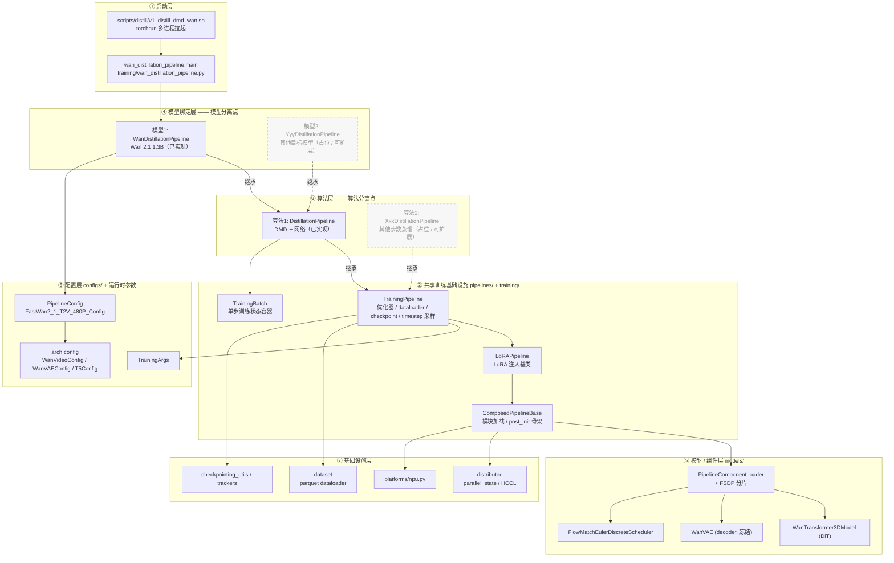

**两个分离点（扩展时只动对应一层）**：

- **算法分离点（算法层）**：所有蒸馏算法都继承 `TrainingPipeline`。`算法1 = DistillationPipeline`（DMD，已实现）；要加 `算法2`（如其他步数蒸馏）只需平级新建一个 `XxxDistillationPipeline(TrainingPipeline)`，复用下方优化器/数据/checkpoint 设施。
- **模型分离点（模型绑定层）**：具体模型绑定继承某个算法。`模型1 = WanDistillationPipeline`（Wan，已实现）；要换 `模型2`（其他目标模型）只需平级新建一个绑定类，改 `_required_config_modules` 与调度器即可。

**核心思想**：启动层只决定"用哪个算法跑哪个模型"；中间两层把"算法"和"模型"沿继承链解耦分离；共享基础设施层提供与算法/模型无关的训练设施；模型/配置层保证组件可被配置驱动地加载；基础设施层屏蔽 NPU/分布式/数据细节。

---

## 3. 目录结构与职责

```text
flashgen/
├── training/                      # ★ 训练核心
│   ├── wan_distillation_pipeline.py  #   入口 main() + Wan 绑定
│   ├── distillation_pipeline.py      #   DMD 三网络算法（generator/real/fake）
│   ├── training_pipeline.py          #   通用训练基础设施基类
│   ├── training_utils.py             #   EMA / scheduler / sigmas / checkpoint 工具
│   ├── checkpointing_utils.py        #   分布式 checkpoint 存取
│   ├── activation_checkpoint.py      #   激活重计算
│   └── trackers.py                   #   wandb / tensorboard 抽象
├── pipelines/                     # 训练用流水线原语（已去推理 stage/basic）
│   ├── composed_pipeline_base.py     #   加载模块 + post_init 骨架
│   ├── lora_pipeline.py              #   LoRA 注入基类
│   └── pipeline_batch_info.py        #   ForwardBatch / TrainingBatch
├── models/                        # 架构定义 + 加载器
│   ├── dits/wanvideo.py              #   WanTransformer3DModel
│   ├── vaes/wanvae.py                #   Wan VAE
│   ├── schedulers/                   #   FlowMatchEulerDiscreteScheduler（自带实现）
│   ├── loader/                       #   组件加载 + FSDP 分片 + 权重映射
│   └── utils.py                      #   pred_noise_to_pred_video 等
├── configs/                       # 两层配置：arch config + pipeline config
│   ├── models/                       #   WanVideoConfig / WanVAEConfig / T5Config
│   └── pipelines/wan.py              #   WanT2V480PConfig / FastWan2_1_T2V_480P_Config
├── dataset/                       # parquet map-style dataloader（预处理 latents+嵌入）
├── distributed/                   # parallel_state + HCCL/NPU 通信器
├── platforms/                     # NPU 平台抽象（SDPA 后端）
├── layers/                        # linear/norm/rope/激活/量化/LoRA 算子
├── attention/                     # 注意力后端选择（SDPA）
├── hooks/                         # 激活追踪 / 分层 offload
├── flashgen_args.py              # FlashgenArgs / TrainingArgs
└── registry.py                    # Wan-DMD-only 模型/配置注册表
```

设计原则：

- **`training/`**：一文件一(模型×方法)。通用设施沉到 `TrainingPipeline`，算法逻辑放 `DistillationPipeline`，模型绑定放 `WanDistillationPipeline`。拓展新算法时**继承这条链**即可。
- **`pipelines/`**：仅保留训练需要的三个原语（`ComposedPipelineBase`、`LoRAPipeline`、`TrainingBatch`），推理的 `stages/`、`basic/`、`pipeline_registry.py`、`worker/` 均已移除。
- **`configs/`**：两层配置——**arch config**（模型是什么）与 **pipeline config**（怎么跑：flow_shift、蒸馏步数、精度）。
- **`models/`**：只放架构定义与加载，调度器用 flashgen 自带实现（已去除 `diffusers` 运行时依赖）。

---

## 4. 核心抽象与继承链

train-only 的可维护性来自一条清晰的**流水线继承链**和一个**单步状态容器**。

### 4.1 流水线继承链

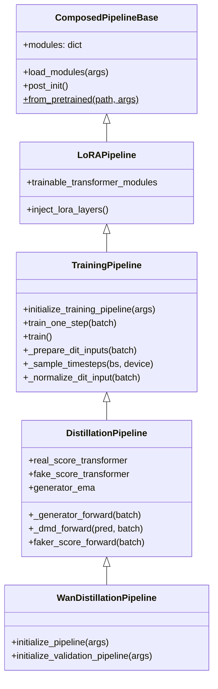

每一层的职责边界非常清晰：

| 类 | 职责 | 拓展新算法时 |
|------|------|--------------|
| `ComposedPipelineBase` | 分布式初始化、按 `model_index.json` 加载模块、`post_init` 调度 | 几乎不动 |
| `LoRAPipeline` | LoRA 注入与可训练集合 | 复用 |
| `TrainingPipeline` | 优化器/调度器/dataloader/tracker/checkpoint/timestep 采样 | 复用大部分 |
| `DistillationPipeline` | **DMD 算法**：三网络、损失、交替优化 | 新算法可平级新建一个 `XxxDistillationPipeline` |
| `WanDistillationPipeline` | 绑定 Wan 模型与调度器 | 换模型时仿写一个 |

`WanDistillationPipeline` 本身极薄——只声明所需模块、初始化 Wan 调度器、关闭验证：

```12:31:flashgen/training/wan_distillation_pipeline.py
class WanDistillationPipeline(DistillationPipeline):
    """
    A distillation pipeline for Wan that uses a single transformer model.
    The main transformer serves as the student model, and copies are made for teacher and critic.
    """
    _required_config_modules = ["scheduler", "transformer", "vae"]

    def initialize_pipeline(self, flashgen_args: FlashgenArgs):
        """Initialize Wan-specific scheduler."""
        self.modules["scheduler"] = FlowMatchEulerDiscreteScheduler(shift=flashgen_args.pipeline_config.flow_shift)

    def create_training_stages(self, training_args: TrainingArgs):
        """
        May be used in future refactors.
        """
        pass

    def initialize_validation_pipeline(self, training_args: TrainingArgs):
        logger.info("Validation video generation is disabled in train-only Flashgen.")
        self.validation_pipeline = None
```

### 4.2 TrainingBatch —— 单步训练状态容器

`pipelines/pipeline_batch_info.py` 的 `TrainingBatch` 承载单步训练的全部中间张量，各方法读写同一个容器，避免长参数列表。关键字段：

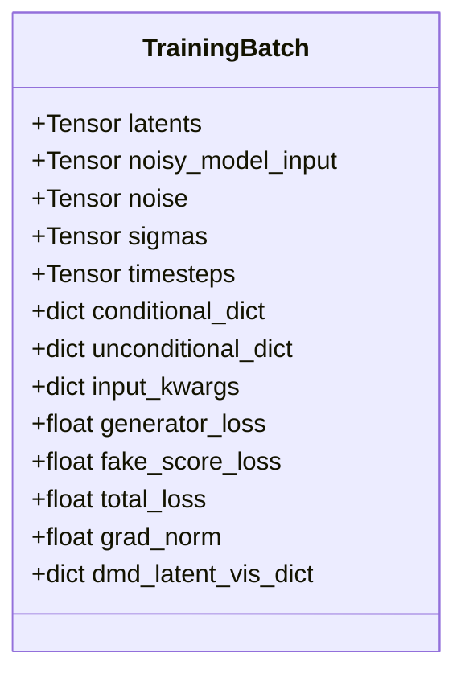

| 字段 | 含义 |
|------|------|
| `latents` | 预处理好的干净 latent（来自 parquet） |
| `noisy_model_input` / `noise` / `sigmas` | 加噪输入、噪声与噪声水平 |
| `conditional_dict` / `unconditional_dict` | 文本条件 / 负向（无条件）嵌入 |
| `input_kwargs` | 组装后喂给 DiT 的前向参数 |
| `generator_loss` / `fake_score_loss` / `total_loss` | DMD 生成器损失、评论家 flow-matching 损失及合计 |
| `dmd_latent_vis_dict` | 可视化/监控用的中间量 |

> 注意：train-only 下文本是**离线预编码**写入 parquet 的，因此训练期不加载 T5；`conditional_dict` / `unconditional_dict` 直接来自数据集与磁盘上的 `negative_prompt_embeds.pt`。

---

## 5. 训练启动与生命周期

### 5.1 从 torchrun 到训练循环

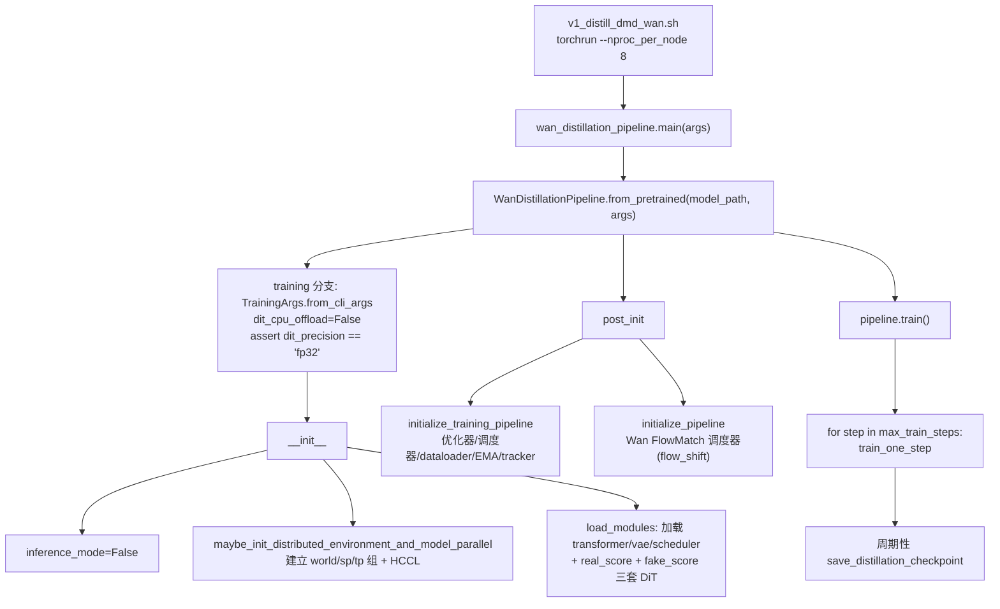

`from_pretrained` 的训练分支是整个生命周期的关键开关：

```268:294:flashgen/pipelines/composed_pipeline_base.py
        if args is None or args.inference_mode:

            kwargs['model_path'] = model_path
            flashgen_args = FlashgenArgs.from_kwargs(**kwargs)
        else:
            assert args is not None, "args must be provided for training mode"
            flashgen_args = TrainingArgs.from_cli_args(args)
            # TODO(will): fix this so that its not so ugly
            flashgen_args.model_path = model_path
            for key, value in kwargs.items():
                setattr(flashgen_args, key, value)

            flashgen_args.dit_cpu_offload = False
            # we hijack the precision to be the master weight type so that the
            # model is loaded with the correct precision. Subsequently we will
            # use FSDP2's MixedPrecisionPolicy to set the precision for the
            # fwd, bwd, and other operations' precision.
            assert flashgen_args.pipeline_config.dit_precision == 'fp32', 'only fp32 is supported for training'

        logger.info("flashgen_args in from_pretrained: %s", flashgen_args)

        pipe = cls(model_path,
                   flashgen_args,
                   required_config_modules=required_config_modules,
                   loaded_modules=loaded_modules)
        pipe.post_init()
        return pipe
```

### 5.2 三套 DiT 的加载

`DistillationPipeline.load_modules` 在基类加载 student(`transformer`) 之外，额外从磁盘加载 teacher 与 critic（两者都必须显式给路径，否则报错），并尝试加载 MoE 的第二专家 `transformer_2`：

```96:135:flashgen/training/distillation_pipeline.py
    def load_modules(self, flashgen_args: FlashgenArgs, loaded_modules: dict[str, torch.nn.Module] | None = None):
        modules = super().load_modules(flashgen_args, loaded_modules)
        training_args = cast(TrainingArgs, flashgen_args)

        if training_args.real_score_model_path:
            logger.info("Loading real score transformer from: %s", training_args.real_score_model_path)
            training_args.override_transformer_cls_name = "WanTransformer3DModel"
            # TODO(will): can use deepcopy instead if the model is the same
            self.real_score_transformer = self.load_module_from_path(training_args.real_score_model_path, "transformer",
                                                                     training_args)
            modules["real_score_transformer"] = self.real_score_transformer
            ...
        else:
            raise ValueError("real_score_model_path is required for DMD distillation pipeline")

        if training_args.fake_score_model_path:
            ...
        else:
            raise ValueError("fake_score_model_path is required for DMD distillation pipeline")

        return modules
```

`initialize_training_pipeline`（distillation 覆盖版）随后冻结 VAE 与 teacher、为 critic 单独建优化器、（可选）激活重计算：

```143:160:flashgen/training/distillation_pipeline.py
        self.noise_scheduler = self.get_module("scheduler")
        self.vae = self.get_module("vae")
        self.vae.requires_grad_(False)

        self.timestep_shift = self.training_args.pipeline_config.flow_shift
        self.noise_scheduler = FlowMatchEulerDiscreteScheduler(shift=self.timestep_shift)

        if self.training_args.boundary_ratio is not None:
            self.boundary_timestep = self.training_args.boundary_ratio * self.noise_scheduler.num_train_timesteps
        else:
            self.boundary_timestep = None

        # make sure the real score transformer is not trainable
        self.real_score_transformer.requires_grad_(False)
        self.real_score_transformer.eval()
```

---

## 6. 训练流程（以 DMD 为例）

Flashgen 把**训练流程框架**与**具体蒸馏算法**解耦：`TrainingPipeline` 提供与算法无关的循环骨架（数据获取、加噪输入准备、梯度累积、梯度裁剪、优化器/调度器步进、checkpoint），具体算法（如 DMD）只在子类里实现各自的前向与损失。

本节以已实现的 DMD 为例讲**训练流程怎么跑**；其三网络分工、学生前向、DMD 损失与 flow-matching 损失的**数学与实现细节**见《[DMD 蒸馏算法实现](DMD蒸馏算法实现.md)》。

### 6.1 单步训练 train_one_step（generator / critic 交替）

一步训练里 generator 与 critic **交替更新**：critic 每步更新，generator 每 `generator_update_interval`（默认 5）步才更新一次；两者都支持梯度累积，generator 更新后做 EMA。下图中 `_generator_forward`、`_dmd_forward`、`faker_score_forward` 的内部计算属于算法细节（见算法文档），此处只关注流程编排：

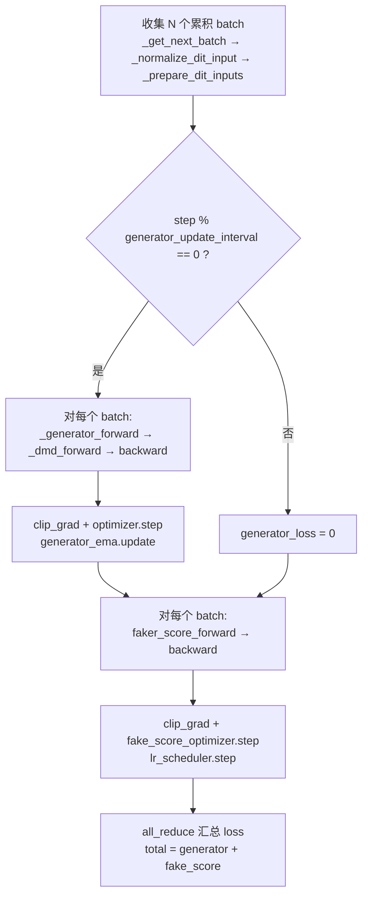

```861:893:flashgen/training/distillation_pipeline.py
        if (self.current_trainstep % self.generator_update_interval == 0):
            for batch in batches:
                batch_gen = self._clone_training_batch(batch)

                with set_forward_context(current_timestep=batch_gen.timesteps,
                                         attn_metadata=batch_gen.attn_metadata):
                    if self.training_args.simulate_generator_forward:
                        generator_pred_video = self._generator_multi_step_simulation_forward(batch_gen)
                    else:
                        generator_pred_video = self._generator_forward(batch_gen)

                with set_forward_context(current_timestep=batch_gen.timesteps, attn_metadata=batch_gen.attn_metadata):
                    dmd_loss = self._dmd_forward(generator_pred_video=generator_pred_video, training_batch=batch_gen)

                with set_forward_context(current_timestep=batch_gen.timesteps,
                                         attn_metadata=batch_gen.attn_metadata):
                    (dmd_loss / gradient_accumulation_steps).backward()
                total_dmd_loss += dmd_loss.detach().item()

            # Only clip gradients for the model that is currently training
            self._clip_model_grad_norm_(batch_gen, self.transformer)
            self.optimizer.step()
            self.optimizer.zero_grad(set_to_none=True)

            if self.generator_ema is not None:
                self.generator_ema.update(self.transformer)
```

### 6.2 train() 主循环

`train()` 在 `bf16 autocast` 下逐步调用 `train_one_step`，按 `ema_start_step` 惰性创建 EMA，周期性 `gc`、记录指标并存 checkpoint：

```1140:1160:flashgen/training/distillation_pipeline.py
        for step in range(self.init_steps + 1, self.training_args.max_train_steps + 1):
            if step % 5 == 0:
                gc.collect()
                current_platform.empty_cache()
            start_time = time.perf_counter()

            training_batch = TrainingBatch()
            self.current_trainstep = step

            if (step >= self.training_args.ema_start_step) and \
                    (self.generator_ema is None) and (self.training_args.ema_decay > 0):
                self.generator_ema = EMA_FSDP(self.transformer, decay=self.training_args.ema_decay)
                logger.info("Created generator EMA at step %s with decay=%s", step, self.training_args.ema_decay)
                ...

            with torch.autocast(current_platform.device_type, dtype=torch.bfloat16):
                training_batch = self.train_one_step(training_batch)
```

---

## 7. 模型与组件加载

流水线不直接 `import` 模型类，而是通过 `PipelineComponentLoader` 按 diffusers `model_index.json` 动态加载，并在训练模式下走 FSDP 分片：

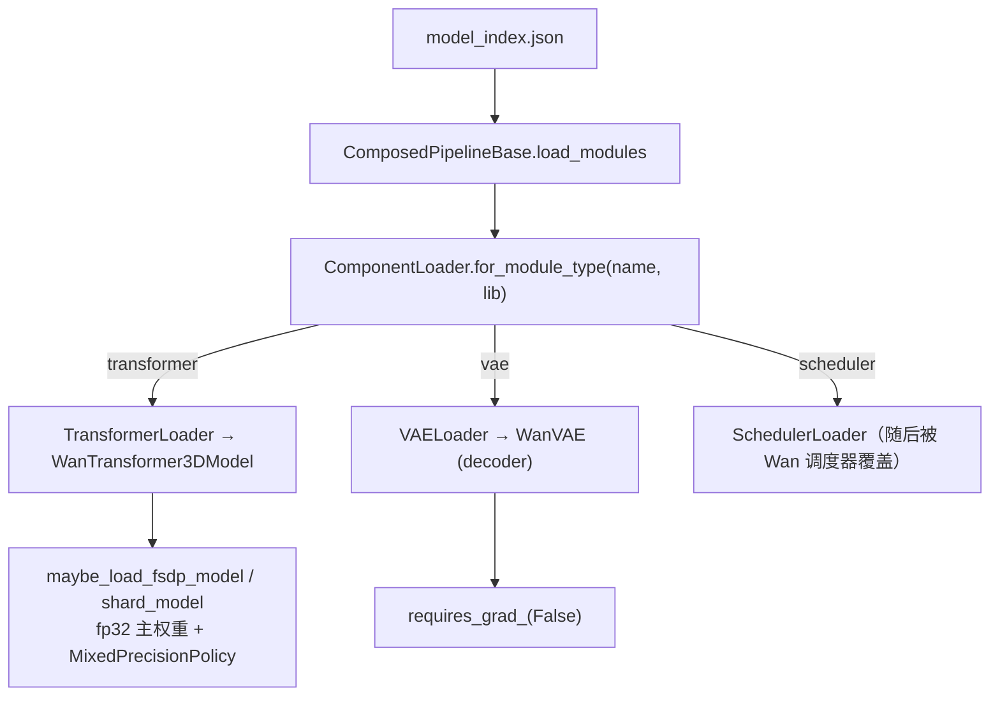

- **精度策略**：DiT 以 **fp32 主权重**加载（满足 `from_pretrained` 的断言），由 FSDP2 的 `MixedPrecisionPolicy` 控制前向/反向用 bf16；VAE 冻结，仅用于可选的中间 latent 可视化。
- **权重映射**：各 Loader 借助 arch config 的 `param_names_mapping` 把 HF 权重键映射到 flashgen 原生 state-dict 键。
- **三套 DiT**：student/teacher/critic 都通过 `load_module_from_path` 复用同一加载路径，保证结构一致。

WanTransformer3DModel（DiT）结构：

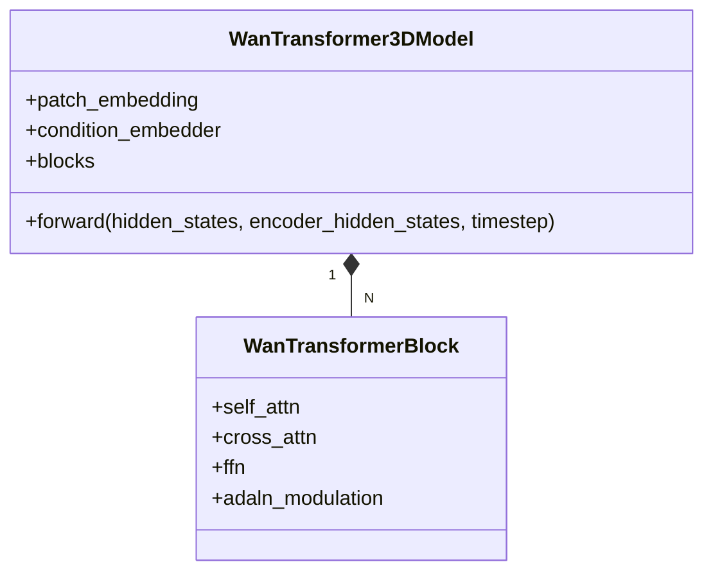

> `self_attn` 含 3D RoPE 并走 SDPA，`cross_attn` 是文本交叉注意力，块内用 AdaLN 调制。

---

## 8. 配置体系

### 8.1 两层配置

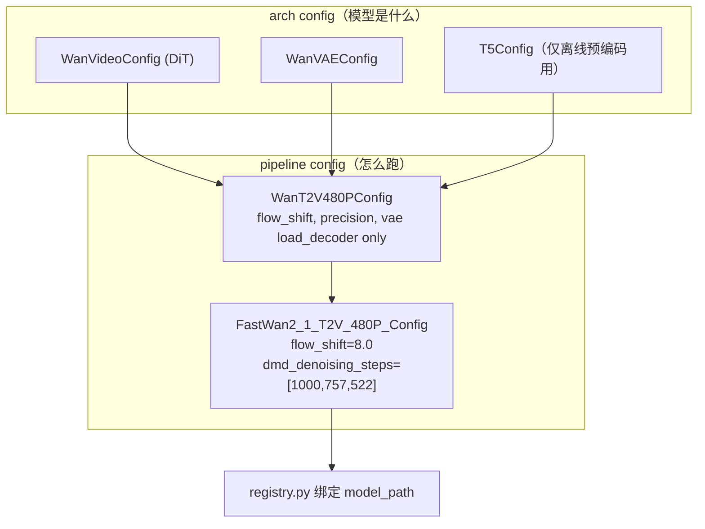

```60:69:flashgen/configs/pipelines/wan.py
@dataclass
class FastWan2_1_T2V_480P_Config(WanT2V480PConfig):
    """Base configuration for FastWan T2V 1.3B 480P pipeline architecture with DMD"""

    # WanConfig-specific parameters with defaults

    # Denoising stage
    flow_shift: float | None = 8.0
    dmd_denoising_steps: list[int] | None = field(default_factory=lambda: [1000, 757, 522])
```

### 8.2 TrainingArgs 关键字段

`TrainingArgs`（继承 `FlashgenArgs`）是贯穿训练的运行时配置：

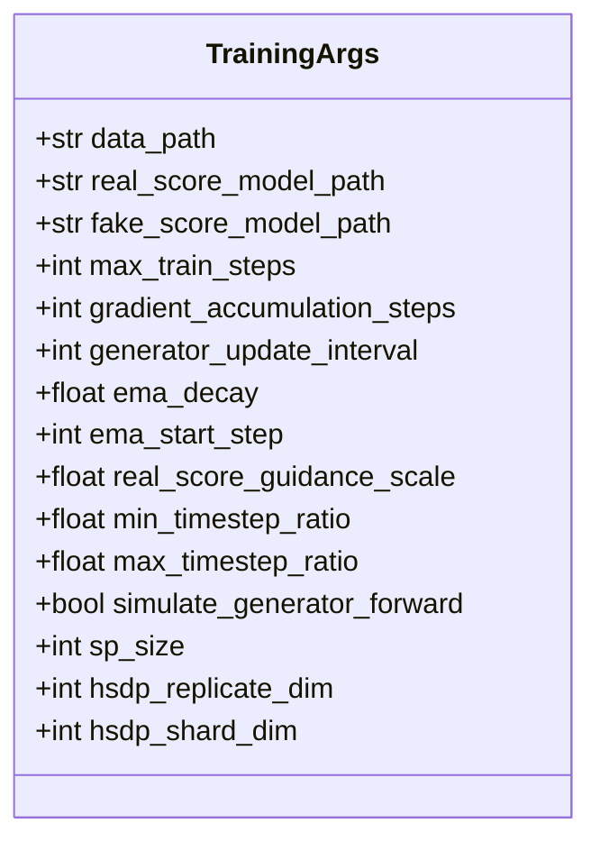

| 字段类型 | 归属 |
|----------|------|
| 架构常量（hidden dim、heads、层数） | `configs/models/<role>/<model>.py` |
| 蒸馏默认值（flow_shift、dmd_denoising_steps） | `configs/pipelines/wan.py` |
| 训练超参（lr、steps、ema、cfg_rate、并行度） | `TrainingArgs` + CLI flag |

---

## 9. 分布式、平台与数据

### 9.1 并行与 FSDP

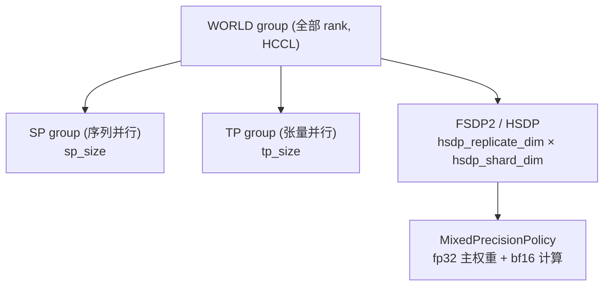

- `maybe_init_distributed_environment_and_model_parallel(tp_size, sp_size)` 在 `ComposedPipelineBase.__init__` 中幂等建组。
- 训练用 **HSDP**（`hsdp_replicate_dim` × `hsdp_shard_dim`）做参数分片 + 复制；`dit_cpu_offload` 训练强制关闭。
- 损失在 `world_group.all_reduce(..., AVG)` 上汇总，时间步在 SP 组内广播保持一致。

### 9.2 NPU 平台与注意力

```66:74:flashgen/platforms/npu.py
    @classmethod
    def get_attn_backend_cls(cls, selected_backend, head_size, dtype) -> str:
        logger.info("Trying FLASHGEN_ATTENTION_BACKEND=%s", envs.FLASHGEN_ATTENTION_BACKEND)
        if envs.FLASHGEN_ATTENTION_BACKEND != "TORCH_SDPA":
            logger.info("Ascend NPU only supports the Torch SDPA backend.")
        else:
            logger.info("Using Torch SDPA backend.")
        return "flashgen.attention.backends.sdpa.SDPABackend"
```

- 分布式后端用 **HCCL**；设备可见性通过 `ASCEND_RT_VISIBLE_DEVICES` 控制。
- 注意力只保留 SDPA 一条路径，不引入自定义 kernel，保证 NPU 可移植性。

### 9.3 数据与 Checkpoint

- **数据**：`build_parquet_map_style_dataloader` 读取**预处理 parquet**（已含 latent + 文本嵌入），按 `pyarrow_schema_t2v` 解析，`training_cfg_rate` 控制条件丢弃做 CFG 训练。
- **负向嵌入**：`post_init` 从 `negative_prompt_embeds_path`（或 `model_path/negative_prompt_embeds`）加载 `.pt`，缺失则零值回退。
- **Checkpoint**：`save_distillation_checkpoint` / `load_distillation_checkpoint` 同时存取 student/critic/optimizer/lr_scheduler/EMA/随机数状态，支持 MoE 第二专家与断点续训。

---

## 10. 扩展点（拓展其他步数蒸馏算法）

当前继承链就是为"加新步数蒸馏算法"预留的骨架：

| 想做的事 | 改动位置 |
|----------|----------|
| **新增一种蒸馏算法**（如 CM/LADD/其他） | 平级新建 `XxxDistillationPipeline(TrainingPipeline)`，实现自己的 `train_one_step` 与损失；复用 `TrainingPipeline` 的优化器/dataloader/checkpoint 设施 |
| 换目标模型（非 Wan） | 仿写一个 `YyyDistillationPipeline(DistillationPipeline)`，改 `_required_config_modules` 与 `initialize_pipeline` 的调度器 |
| 调整蒸馏步数 / flow_shift | `configs/pipelines/wan.py`（`dmd_denoising_steps`、`flow_shift`）或 CLI |
| 改时间步采样策略 | `TrainingPipeline._sample_timesteps` / `DistillationPipeline` 的 timestep shift |
| 改权重加载/精度 | `models/loader/component_loader.py` + arch config 的 `param_names_mapping` |
| 新增可视化/监控 | `visualize_intermediate_latents`（子类实现）+ `trackers.py` |

设计亮点：

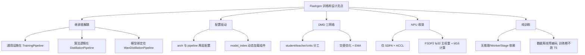

### 一句话架构

> **Flashgen（train-only）= 一条 `ComposedPipelineBase → TrainingPipeline → DistillationPipeline → WanDistillationPipeline` 继承链 + 三网络 DMD 交替优化循环 + NPU/FSDP 基础设施**，把预处理数据蒸馏成可少步推理的学生 DiT 权重；推理交由其他库完成。

---

*本文档基于源码静态分析生成，关键代码位置均以 `路径:行号` 标注，便于对照查阅。*
