# Flashgen 架构设计文档

> 版本：基于当前代码库快照（Wan 2.1 1.3B DMD，NPU 专用分支）
> 文档目标：结合源码，系统讲解 Flashgen 的设计理念、分层架构、推理/训练数据流与关键扩展点。

---

## 1. 项目概述

**Flashgen** 是基于 `FastVideo_fork` 裁剪而来的、**面向 NPU（昇腾）的轻量化视频生成运行时**。它保留了 FastVideo 的核心运行时架构，但把支持面**收敛到单一模型族**：`Wan 2.1 1.3B` 文生视频（T2V），并采用 **DMD（Distribution Matching Distillation，分布匹配蒸馏）** 进行少步推理（默认 3 步去噪）。

设计上的几个硬约束（来自 `README.md` 与代码）：

| 维度 | 取值 | 说明 |
|------|------|------|
| 支持模型 | 仅 `WanDMDPipeline`（Wan 2.1 1.3B DMD） | `pipeline_registry.py` 中 BASIC 类型硬编码只加载该 pipeline |
| 注意力后端 | 仅 `TORCH_SDPA` | `platforms/npu.py` 强制返回 SDPA 后端，不依赖自定义 kernel |
| 目标硬件 | NPU（昇腾，HCCL 通信） | `gpu_worker.py` 中非 NPU 平台直接抛错 |
| 去噪步数 | DMD 少步（默认 `[1000, 757, 522]`） | `FastWan2_1_T2V_480P_Config.dmd_denoising_steps` |

整体上，Flashgen 是一个 **"配置驱动 + 阶段组合 + 多进程 Worker 执行"** 的扩散推理引擎，其架构思想大量借鉴了 vLLM / SGLang（Executor、Worker、collective_rpc、registry 等概念）。

---

## 2. 分层架构总览

Flashgen 自顶向下可以分为 6 层：**入口层 → 引擎/编排层 → 执行/进程层 → 流水线层 → 模型/组件层 → 基础设施层**。

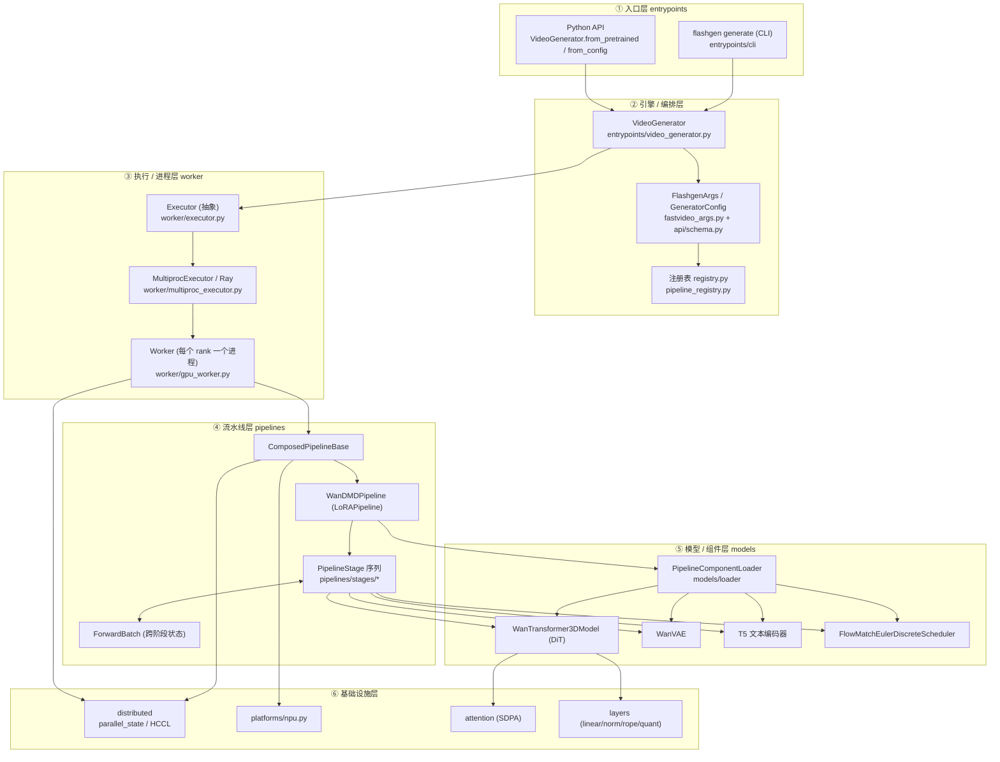

**核心思想**：上层只负责"描述要做什么"（配置 + 请求），中层负责"在哪做"（进程/设备编排），下层负责"怎么做"（阶段组合 + 模型前向）。每一层之间通过明确的数据结构（`GeneratorConfig`、`FlashgenArgs`、`ForwardBatch`）解耦。

---

## 3. 目录结构与职责

```text
flashgen/
├── entrypoints/          # 入口：CLI + VideoGenerator + streaming
│   ├── cli/              #   flashgen generate 子命令
│   └── video_generator.py#   统一推理入口（编排 + 后处理/存盘）
├── api/                  # 类型化请求/响应 schema、采样参数、兼容层
├── fastvideo_args.py     # FlashgenArgs / TrainingArgs / WorkloadType
├── registry.py           # Wan-DMD-only 模型/配置/预设注册表
├── worker/               # Executor 抽象 + 多进程/Ray 执行器 + Worker
├── pipelines/            # 阶段组合式流水线
│   ├── composed_pipeline_base.py  # 流水线基类（加载模块/建阶段/forward）
│   ├── pipeline_batch_info.py     # ForwardBatch / TrainingBatch 数据结构
│   ├── pipeline_registry.py       # 流水线类发现与解析
│   ├── lora_pipeline.py           # LoRA 支持基类
│   ├── basic/wan/wan_dmd_pipeline.py  # WanDMDPipeline 具体编排
│   └── stages/                    # 可复用阶段：validate/encode/...denoise/decode
├── models/               # DiT / VAE / 编码器 / 调度器 + loader
│   ├── dits/wanvideo.py  #   WanTransformer3DModel
│   ├── vaes/wanvae.py    #   Wan VAE
│   ├── encoders/t5.py    #   T5 文本编码器
│   ├── schedulers/       #   FlowMatchEulerDiscreteScheduler
│   └── loader/           #   组件加载 + FSDP 分片 + 权重映射
├── configs/              # 配置驱动：arch config + pipeline config
├── layers/               # 线性/归一化/RoPE/激活/量化等算子
├── distributed/          # parallel_state + HCCL/NPU 通信器
├── platforms/            # NPU 平台抽象
├── attention/            # 注意力后端选择（SDPA）
├── training/             # 训练/蒸馏流水线（DMD distillation）
└── hooks/                # 激活追踪 / 分层 offload
```

设计原则（来自各目录 `AGENTS.md`）：

- **`pipelines/`**：流水线是 `PipelineStage` 的**组合**而非继承大类。每个阶段只负责一个动词（validate / encode / schedule / denoise / decode）。
- **`configs/`**：两层配置——**arch config**（模型是什么：层数、维度）与 **pipeline config**（怎么跑：步数、CFG、精度）。配置与流水线单向依赖。
- **`models/`**：仅放架构定义，运行时不在 forward 路径 import transformers/diffusers，分布式调用必须走 `flashgen.distributed`。
- **`training/`**：维护态的"一文件一(模型×方法)"单体训练流水线。

---

## 4. 核心抽象与设计理念

Flashgen 的可维护性来自四个核心抽象，理解它们就理解了整个系统。

### 4.1 ForwardBatch —— 跨阶段的"状态容器"

`pipelines/pipeline_batch_info.py` 中的 `ForwardBatch` 是一个大 dataclass，承载从输入到输出的**全部中间状态**。各阶段不通过参数传递，而是**读写同一个 `ForwardBatch`**，避免了"几十个参数层层传递"的问题（设计灵感来自 SGLang 的 `ForwardBatchInfo`）。

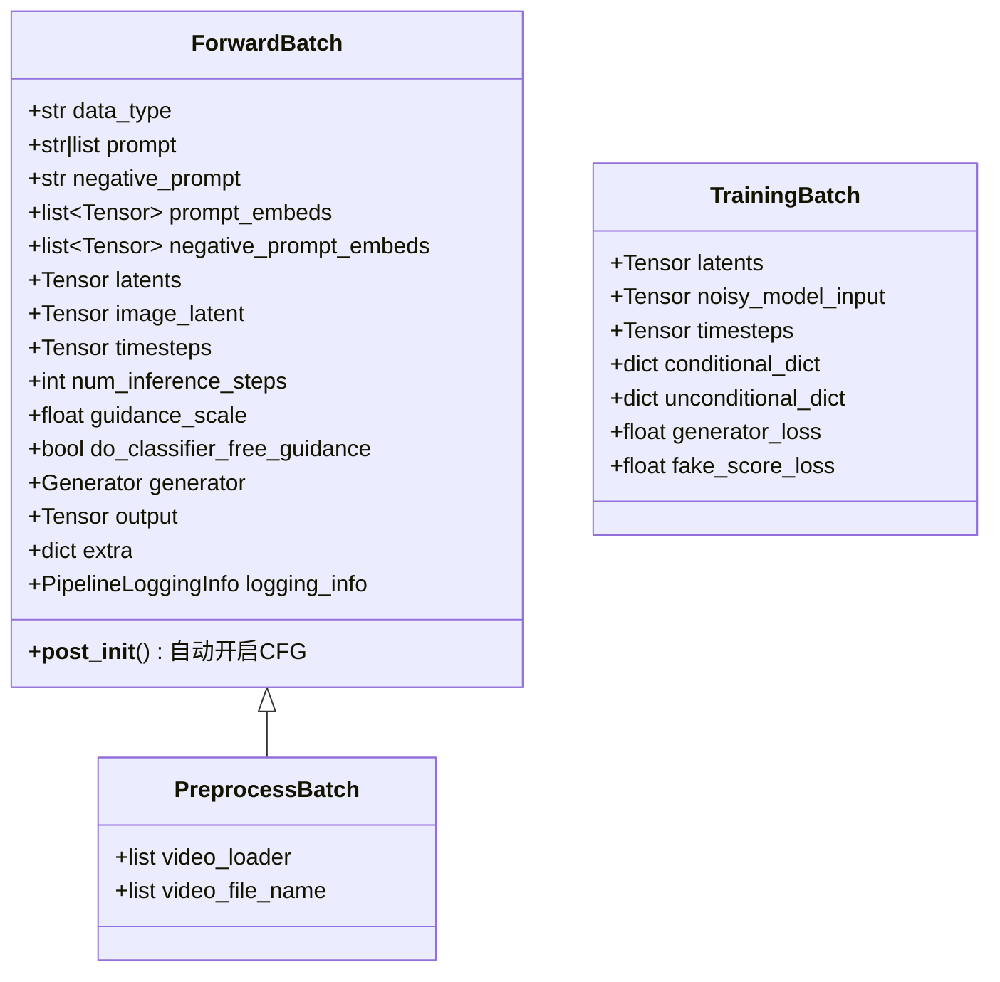

关键约定（`pipelines/AGENTS.md`）：阶段**只能重新赋值在 dataclass 中声明过的字段**；要加新字段必须先改 `ForwardBatch`；禁止用模块级全局 dict 传状态。

`__post_init__` 中有一个重要的隐式行为——根据 `guidance_scale > 1.0` 自动把 `do_classifier_free_guidance` 置 `True`：

```249:259:flashgen/pipelines/pipeline_batch_info.py
    def __post_init__(self):
        """Initialize dependent fields after dataclass initialization."""

        # Enable CFG for standard guidance_scale and LTX-2 text CFG scales.
        ltx2_text_cfg_enabled = (self.ltx2_cfg_scale_video != 1.0 or self.ltx2_cfg_scale_audio != 1.0)
        if self.guidance_scale > 1.0 or ltx2_text_cfg_enabled:
            self.do_classifier_free_guidance = True
```

### 4.2 PipelineStage —— 单一职责的可组合阶段

每个阶段继承 `PipelineStage`，实现 `forward(batch, args) -> ForwardBatch`，并可实现 `verify_input` / `verify_output` 做契约校验（失败抛 `StageVerificationError`）。阶段必须是 **"给定相同 ForwardBatch + FlashgenArgs 即确定"** 的，副作用只允许日志/profiling。

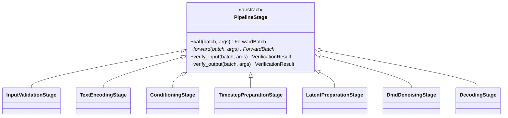

### 4.3 ComposedPipelineBase —— 流水线编排骨架

`composed_pipeline_base.py` 提供了所有流水线的通用骨架：初始化分布式环境、加载模块、（可选）torch.compile、组装阶段、顺序执行。`WanDMDPipeline` 只需声明所需模块并实现 `create_pipeline_stages`。

`forward` 的核心非常简洁——就是顺序跑每个阶段：

```486:511:flashgen/pipelines/composed_pipeline_base.py
    @torch.no_grad()
    def forward(
        self,
        batch: ForwardBatch,
        fastvideo_args: FlashgenArgs,
    ) -> ForwardBatch:
        if not self.post_init_called:
            self.post_init()

        # Execute each stage
        logger.info("Running pipeline stages: %s", self._stage_name_mapping.keys())
        for stage in self.stages:
            batch = stage(batch, fastvideo_args)

        # Return the output
        return batch
```

而 `WanDMDPipeline` 的编排只是把 7 个阶段按序 `add_stage`：

```33:58:flashgen/pipelines/basic/wan/wan_dmd_pipeline.py
    def create_pipeline_stages(self, fastvideo_args: FlashgenArgs) -> None:
        """Set up pipeline stages with proper dependency injection."""

        self.add_stage(stage_name="input_validation_stage", stage=InputValidationStage())

        self.add_stage(stage_name="prompt_encoding_stage",
                       stage=TextEncodingStage(
                           text_encoders=[self.get_module("text_encoder")],
                           tokenizers=[self.get_module("tokenizer")],
                       ))

        self.add_stage(stage_name="conditioning_stage", stage=ConditioningStage())

        self.add_stage(stage_name="timestep_preparation_stage",
                       stage=TimestepPreparationStage(scheduler=self.get_module("scheduler")))

        self.add_stage(stage_name="latent_preparation_stage",
                       stage=LatentPreparationStage(scheduler=self.get_module("scheduler"),
                                                    transformer=self.get_module("transformer", None),
                                                    use_btchw_layout=True))

        self.add_stage(stage_name="denoising_stage",
                       stage=DmdDenoisingStage(transformer=self.get_module("transformer"),
                                               scheduler=self.get_module("scheduler")))

        self.add_stage(stage_name="decoding_stage", stage=DecodingStage(vae=self.get_module("vae")))
```

### 4.4 配置驱动的注册表 —— registry

`registry.py` 把"模型路径 → pipeline 类 + pipeline config + 采样参数"绑定起来。Flashgen 把它收敛到只注册 Wan T2V 一族：

```125:137:flashgen/registry.py
def _register_configs() -> None:
    register_configs(
        sampling_param_cls=None,
        pipeline_config_cls=FastWan2_1_T2V_480P_Config,
        workload_types=(WorkloadType.T2V, ),
        hf_model_paths=[
            "Wan-AI/Wan2.1-T2V-1.3B-Diffusers",
            "FastVideo/FastWan2.1-T2V-1.3B-Diffusers",
        ],
        model_detectors=[lambda path: "wandmdpipeline" in path.lower()],
        model_family="wan",
        default_preset="fast_wan_t2v_480p",
    )
```

而 `pipeline_registry.py` 的 BASIC 分支被硬编码为**只导入 `wan_dmd_pipeline`** 一个模块：

```139:150:flashgen/pipelines/pipeline_registry.py
        if pipeline_type_str == PipelineType.BASIC.value:
            dmd_modules = (
                "flashgen.pipelines.basic.wan.wan_dmd_pipeline",
            )
            for module_name in dmd_modules:
                pipeline_module = importlib.import_module(module_name)
                entry_cls = pipeline_module.EntryClass
                ...
```

这正是 README 所述"BASIC pipeline registry 被刻意限制为 Wan 2.1 1.3B DMD"的实现点。

---

## 5. 推理流程（端到端）

### 5.1 从命令行到视频文件的全景

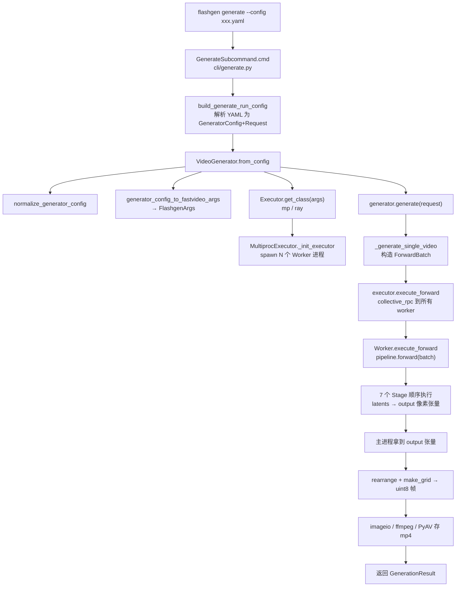

关键转换链：**YAML → `GeneratorConfig`（类型化 schema）→ `FlashgenArgs`（运行时参数）→ `ForwardBatch`（执行状态）→ `output` 张量 → mp4 文件**。

CLI 入口非常薄，真正的编排在 `VideoGenerator`：

```25:35:flashgen/entrypoints/cli/generate.py
    def cmd(self, args: argparse.Namespace) -> None:
        run_config = getattr(args, _VALIDATED_RUN_CONFIG_ATTR, None)
        if run_config is None:
            run_config = build_generate_run_config(...)
        generator = VideoGenerator.from_config(run_config.generator)
        generator.generate(run_config.request)
```

### 5.2 进程与执行器模型

Flashgen 采用 **多进程（每个设备 rank 一个进程）** 模型。主进程持有 `Executor`，通过 `Pipe` + `collective_rpc` 向各 Worker 发送控制消息；每个 Worker 持有完整的 pipeline 并在 NPU 上执行前向。

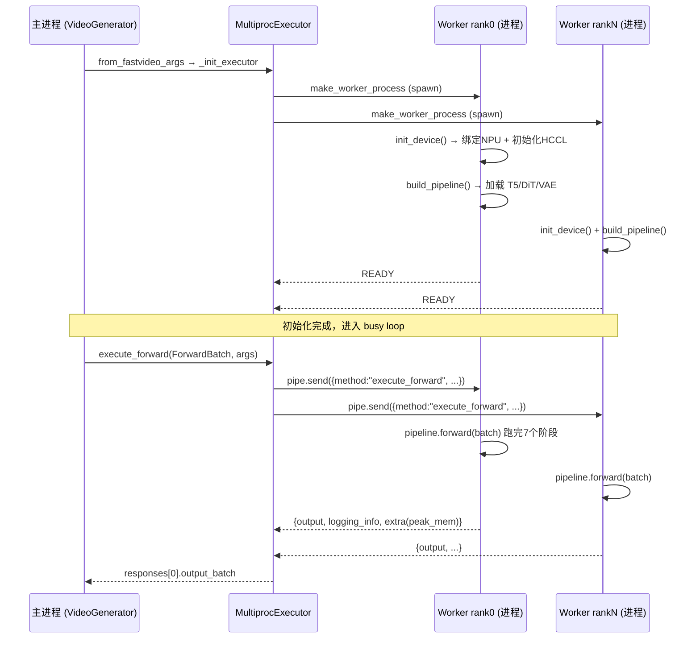

- `Executor.get_class` 根据 `distributed_executor_backend` 选择 `mp`（默认）或 `ray`。
- Worker 进程的核心循环 `worker_busy_loop` 收到 `execute_forward` 后调用 `pipeline.forward`，并把输出张量、stage 日志、峰值显存通过 pipe 回传（见 `multiproc_executor.py` L682-697）。
- Worker 强制 NPU：非 NPU 平台在 `init_device` 直接 `raise RuntimeError("Flashgen is NPU-only")`（`gpu_worker.py` L60-64）。

主进程侧还用了一个小技巧：在**独立线程**里执行 `execute_forward`，同时主线程预分配 pin-memory 的像素缓冲，减少拷贝阻塞（`video_generator.py` L727-752）。

### 5.3 七阶段流水线时序

`WanDMDPipeline` 由 7 个阶段构成。下图展示一次 T2V 推理时 `ForwardBatch` 在阶段间的演化：

```mermaid
flowchart LR
    IN["ForwardBatch<br/>prompt, num_frames,<br/>height, width, seed"]

    S1["①InputValidation<br/>校验形状/参数"]
    S2["②TextEncoding<br/>T5 编码 prompt/neg<br/>→ prompt_embeds"]
    S3["③Conditioning<br/>CFG/负向扇出"]
    S4["④TimestepPreparation<br/>scheduler 生成 timesteps"]
    S5["⑤LatentPreparation<br/>初始化噪声 latents (BTCHW)"]
    S6["⑥DmdDenoising<br/>少步去噪 (1000,757,522)"]
    S7["⑦Decoding<br/>VAE 解码 → 像素"]
    OUT["batch.output<br/>(B,C,T,H,W)"]

    IN --> S1 --> S2 --> S3 --> S4 --> S5 --> S6 --> S7 --> OUT
```

| 阶段 | 输入（读 ForwardBatch） | 输出（写 ForwardBatch） | 依赖模块 |
|------|------|------|------|
| InputValidation | prompt / 尺寸 / 步数 | （校验，不改） | — |
| TextEncoding | prompt, negative_prompt | prompt_embeds, negative_prompt_embeds | T5 + tokenizer |
| Conditioning | do_classifier_free_guidance | 负向条件扇出 | — |
| TimestepPreparation | num_inference_steps | timesteps | scheduler |
| LatentPreparation | seed, 尺寸 | latents（初始噪声） | scheduler, transformer |
| DmdDenoising | latents, prompt_embeds, timesteps | latents（去噪后） | DiT transformer |
| Decoding | latents | output（像素张量） | VAE |

### 5.4 DMD 去噪原理（推理核心）

普通扩散需要几十步迭代，而 **DMD 蒸馏后的学生模型只需 3 步**。`DmdDenoisingStage` 用一个固定的 `dmd_denoising_steps`（`[1000, 757, 522]`）列表，每步：模型预测噪声 → 转成"干净视频" → 若非最后一步则按下一时间步重新加噪。

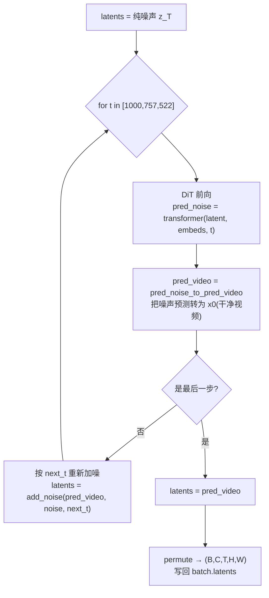

对应核心代码（注意去噪步数直接来自 pipeline_config，而非 scheduler 推导）：

```1143:1211:flashgen/pipelines/stages/denoising.py
        timesteps = torch.tensor(fastvideo_args.pipeline_config.dmd_denoising_steps,
                                 dtype=torch.long,
                                 device=get_local_torch_device())

        # Run denoising loop
        with self.progress_bar(total=len(timesteps)) as progress_bar:
            for i, t in enumerate(timesteps):
                ...
                pred_noise = self.transformer(
                    latent_model_input.permute(0, 2, 1, 3, 4),
                    prompt_embeds, t_expand, guidance=guidance_expand, ...
                ).permute(0, 2, 1, 3, 4)

                pred_video = pred_noise_to_pred_video(
                    pred_noise=pred_noise.flatten(0, 1),
                    noise_input_latent=noise_latents.flatten(0, 1),
                    timestep=t_expand, scheduler=self.scheduler
                ).unflatten(0, pred_noise.shape[:2])

                if i < len(timesteps) - 1:
                    next_timestep = timesteps[i + 1] * torch.ones([1], ...)
                    noise = torch.randn(video_raw_latent_shape, ...)
                    latents = self.scheduler.add_noise(
                        pred_video.flatten(0, 1), noise.flatten(0, 1),
                        next_timestep).unflatten(0, pred_video.shape[:2])
                else:
                    latents = pred_video
```

> 对比基类 `DenoisingStage`：标准去噪走的是 `scheduler.step` + 完整 CFG（含 CFG gating 优化、Wan2.2 高低噪专家切换等），而 `DmdDenoisingStage` 用"预测-加噪"循环，无需 CFG 双前向，因此推理极快。

---

## 6. 模型与组件层

### 6.1 组件加载体系

流水线不直接 `import` 模型类，而是通过 `PipelineComponentLoader` 按 diffusers 的 `model_index.json` 动态加载组件。`ComponentLoader.for_module_type` 是一个工厂，把模块名映射到具体 Loader：

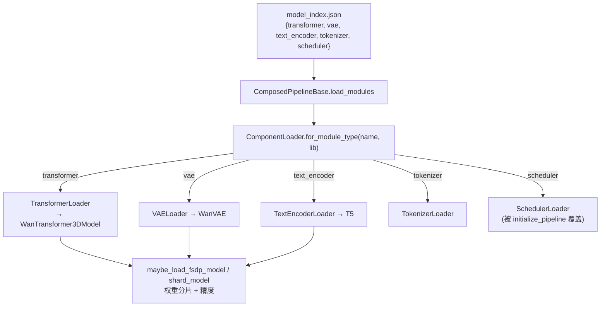

每个 Loader 会借助 arch config 的 `param_names_mapping` 把 HF 权重键映射到 Flashgen 原生 state-dict 键，并按 `precision`（DiT bf16 / VAE fp32 / T5 fp32）加载、必要时做 FSDP 分片。`WanDMDPipeline` 还在 `initialize_pipeline` 中把 scheduler 替换为带 `flow_shift` 的 `FlowMatchEulerDiscreteScheduler`。

### 6.2 WanTransformer3DModel（DiT）

DiT 是去噪主干。`models/dits/wanvideo.py` 的关键结构：

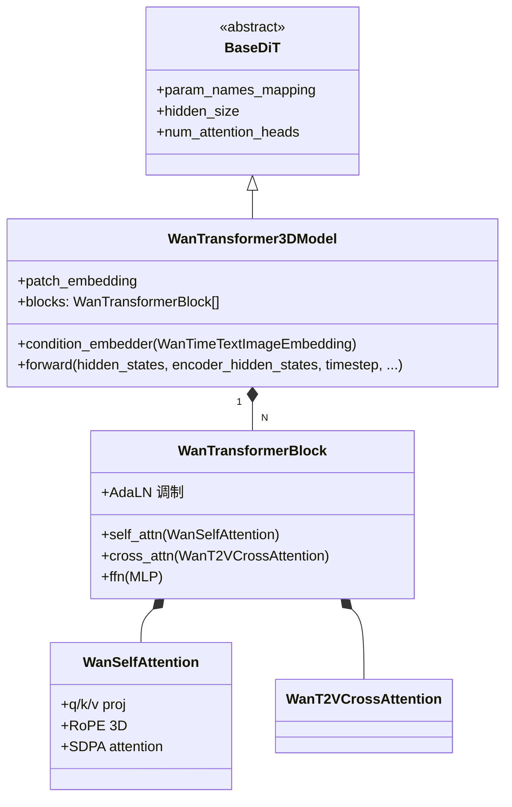

- **patch embedding**：把 5D latent（B,C,T,H,W）切 patch 投影到 hidden。
- **condition embedder**：融合 timestep 嵌入 + 文本（+ 可选图像）条件，产生 AdaLN 调制参数。
- **N 个 transformer block**：自注意力（带 3D RoPE）+ 文本交叉注意力 + FFN。注意力统一走 SDPA 后端。

### 6.3 三大组件的协作

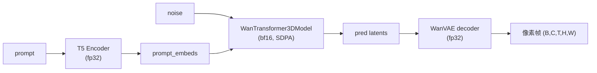

注意 Flashgen 的 Wan VAE 配置 `load_encoder=False, load_decoder=True`——推理只需解码器（T2V 不需要把像素编回 latent）。

---

## 7. 配置与注册体系

### 7.1 两层配置模型

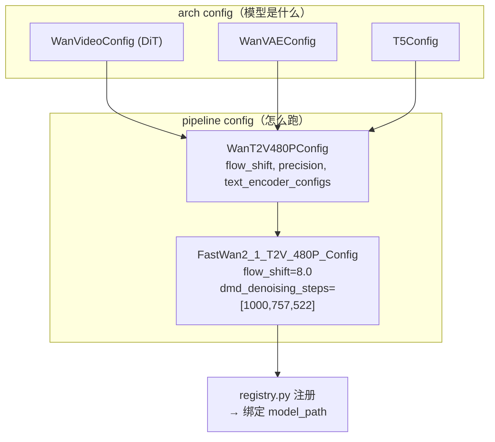

字段归属规则（`configs/AGENTS.md`）：

| 字段类型 | 归属 |
|----------|------|
| 架构常量（hidden dim、heads、层数） | `configs/models/<role>/<model>.py` |
| 默认采样参数（steps、cfg、shift、fps） | `configs/pipelines/<model>.py` |
| 运行时覆盖（precision、sp_size、tp_size、后端） | `PipelineConfig` 默认值 + CLI flag |
| 每次调用可调（per-request） | `SamplingParam`（而非 PipelineConfig） |

### 7.2 请求解析链路

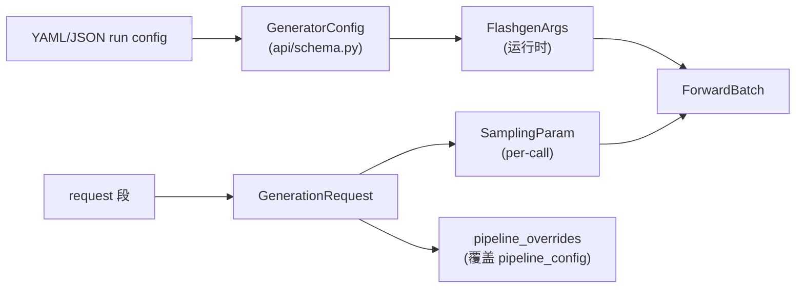

`VideoGenerator._generate_single_request` 会把 request 转成 `SamplingParam` 和 pipeline 覆盖项，再 `shallow_asdict(sampling_param)` 构造 `ForwardBatch`（`video_generator.py` L459-481、L707-711）。

---

## 8. 分布式、平台与基础设施

### 8.1 并行状态与通信组

`distributed/parallel_state.py` 借鉴 vLLM 的 `GroupCoordinator`，维护多套并行组：

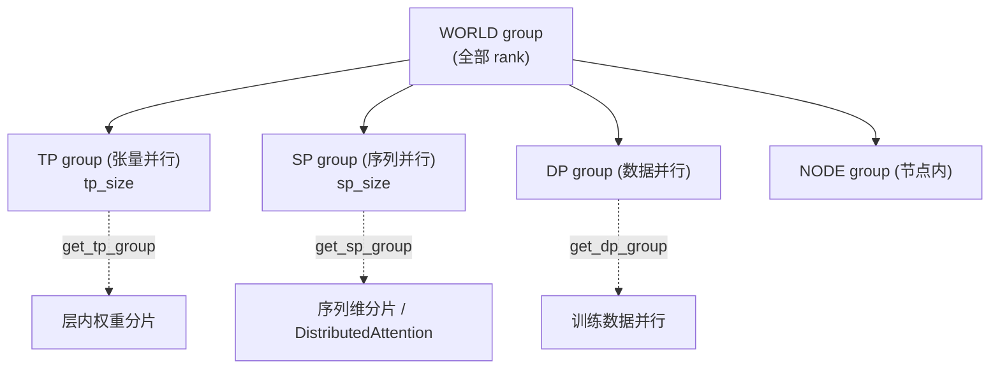

- `maybe_init_distributed_environment_and_model_parallel(tp_size, sp_size)` 在 pipeline 初始化（`ComposedPipelineBase.__init__`）与 Worker `init_device` 中被调用，幂等地建立通信组。
- 推理默认 `tp_size=1, sp_size=1`（单卡），序列并行/张量并行主要服务于多卡训练。

### 8.2 NPU 平台抽象

`platforms/npu.py` 的 `NPUPlatform` 把所有设备相关操作（set_device、empty_cache、mem_get_info、通信器、分布式 PG 初始化）封装为统一接口，关键点：

```66:74:flashgen/platforms/npu.py
    @classmethod
    def get_attn_backend_cls(cls, selected_backend, head_size, dtype) -> str:
        logger.info("Trying FLASHGEN_ATTENTION_BACKEND=%s", envs.FLASHGEN_ATTENTION_BACKEND)
        if envs.FLASHGEN_ATTENTION_BACKEND != "TORCH_SDPA":
            logger.info("Ascend NPU only supports the Torch SDPA backend.")
        else:
            logger.info("Using Torch SDPA backend.")
        return "flashgen.attention.backends.sdpa.SDPABackend"
```

- 分布式后端用 **HCCL**（`ProcessGroupHCCL`），通过 `stateless_init_device_torch_dist_pg` 创建。
- 设备可见性通过 `ASCEND_RT_VISIBLE_DEVICES` 控制；`simple_compile_backend="eager"` 即默认关闭 torch.compile。

### 8.3 注意力后端选择

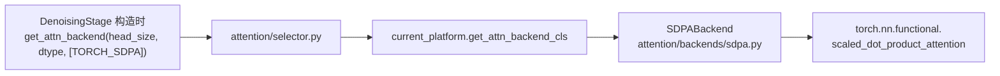

整个分支只保留 SDPA 一条路径，不引入任何自定义 attention kernel，保证 NPU 兼容性与可移植性。

---

## 9. 训练 / 蒸馏流程（DMD Distillation）

推理用的 3 步学生模型，正是由 `training/` 中的 **DMD 蒸馏**训练出来的。训练栈是"torchrun 直接拉起、一文件一(模型×方法)"的单体风格。

### 9.1 训练栈类层次

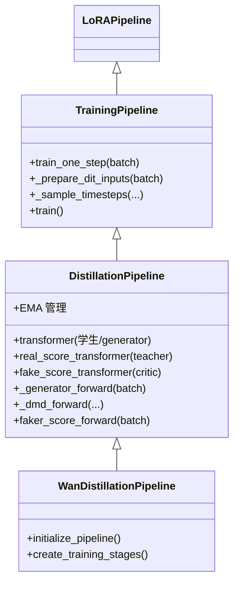

DMD 涉及**三个网络**：

| 角色 | 字段 | 作用 | 是否更新 |
|------|------|------|----------|
| Generator（学生） | `transformer` | 少步生成，最终用于推理 | ✅ 训练 |
| Real score（教师） | `real_score_transformer` | 预训练真实分数模型，提供"真实分布"梯度 | ❌ 冻结 |
| Fake score（评论家） | `fake_score_transformer` | 拟合学生输出分布的分数 | ✅ 训练 |

### 9.2 DMD 训练一步的数据流

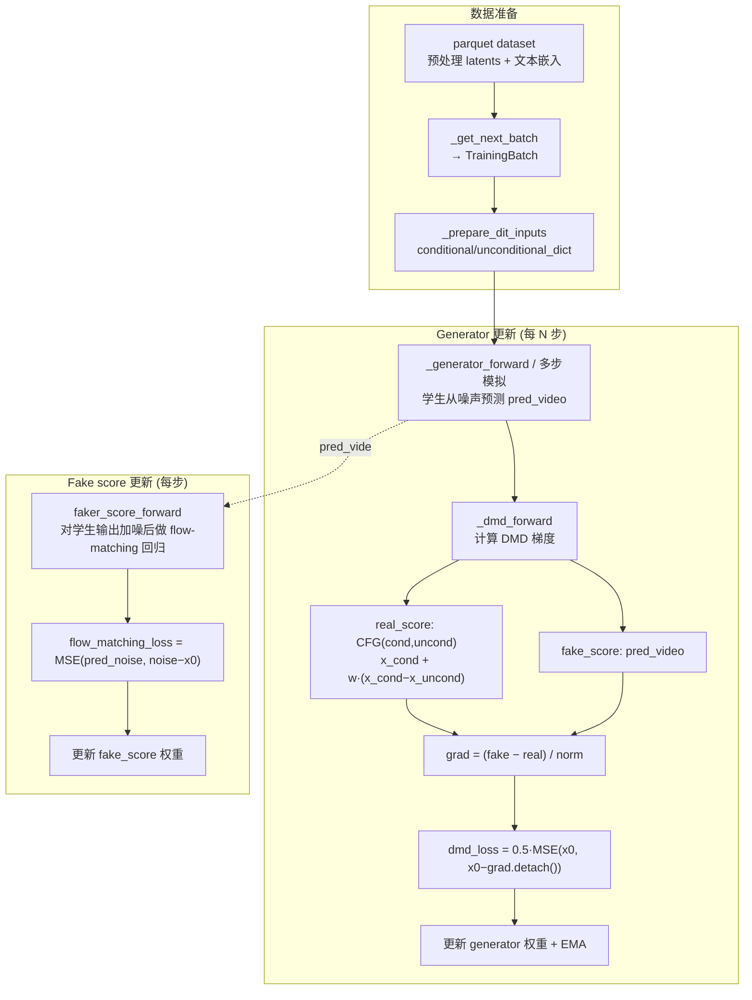

DMD 损失的核心思想：让学生输出的分布与教师（real score）刻画的真实数据分布对齐，梯度来自"假分数与真分数之差"：

```683:700:flashgen/training/distillation_pipeline.py
            # CFG on the real-score teacher ... DMD2 parameterization
            real_score_pred_video = pred_real_video_cond + (pred_real_video_cond -
                                                            pred_real_video_uncond) * self.real_score_guidance_scale

            grad = (faker_score_pred_video - real_score_pred_video) / torch.abs(original_latent -
                                                                                real_score_pred_video).mean()
            grad = torch.nan_to_num(grad)

        dmd_loss = 0.5 * F.mse_loss(original_latent.float(), (original_latent.float() - grad.float()).detach())
```

### 9.3 训练启动与并行

训练通过 `torchrun` 直接拉起 `wan_distillation_pipeline.py`（见 `scripts/distill/v1_distill_dmd_wan.sh`）：

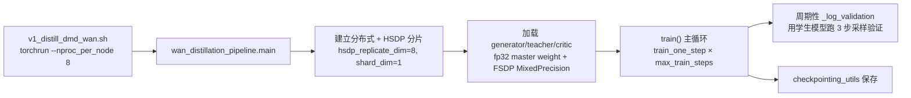

关键约束（来自脚本与 `from_pretrained`）：训练模式下 DiT 必须以 **fp32 主权重**加载（`assert dit_precision == 'fp32'`），再由 FSDP2 的 `MixedPrecisionPolicy` 控制前向/反向精度；`dit_cpu_offload` 在训练时强制关闭。

> 注意 `training/AGENTS.md` 指出该目录处于维护态；新模型/新方法应去新的 `flashgen/train/` 栈，且两栈禁止互相 import。

---

## 10. 关键数据结构与参数

### 10.1 FlashgenArgs（运行时参数核心）

`fastvideo_args.py` 的 `FlashgenArgs` 是贯穿全程的运行时配置，要点字段：

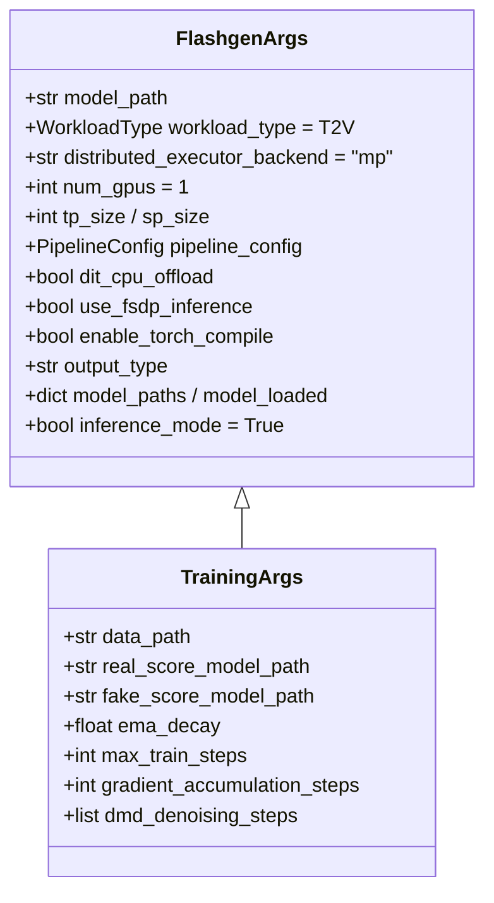

### 10.2 数据流中的三个核心容器

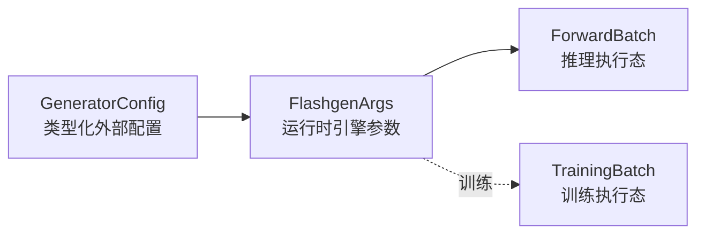

- **`GeneratorConfig`/`GenerationRequest`**：面向用户的类型化外部契约（schema），与具体引擎无关。
- **`FlashgenArgs`**：引擎内部运行时参数（设备、并行、offload、pipeline_config）。
- **`ForwardBatch`/`TrainingBatch`**：单次前向/单步训练的可变状态容器。

---

## 11. 设计总结与扩展点

### 11.1 设计亮点

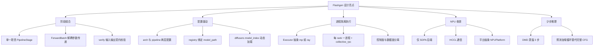

### 11.2 典型扩展点（在当前架构下）

| 想做的事 | 改动位置 |
|----------|----------|
| 增加一个推理阶段 | 在 `pipelines/stages/` 新建 `PipelineStage`，在 `wan_dmd_pipeline.py` `add_stage` |
| 调整去噪步数/CFG | `configs/pipelines/wan.py`（`dmd_denoising_steps`、`flow_shift`）或 request 覆盖 |
| 接入新的执行后端 | 实现 `Executor` 子类，在 `Executor.get_class` 注册 |
| 修改权重加载/精度 | `models/loader/component_loader.py` + arch config 的 `param_names_mapping` |
| 训练新蒸馏变体（同模型族） | `training/` 内 fork 对应 pipeline；新模型请用 `flashgen/train/` |

### 11.3 一句话架构

> **Flashgen = 配置驱动的注册表 + 阶段组合式流水线 + 多进程 NPU Worker 执行器**，把 Wan 2.1 1.3B 的 DMD 少步视频生成，封装成一条从 YAML 到 mp4 的确定性数据流水线。

---

*本文档基于源码静态分析生成，关键代码位置均已在文中以 `路径:行号` 形式标注，便于对照查阅。*
