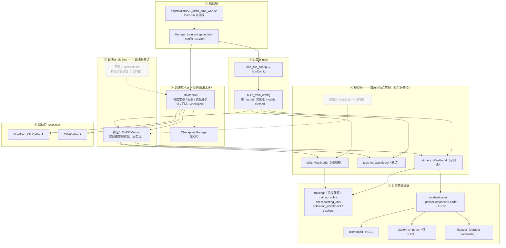
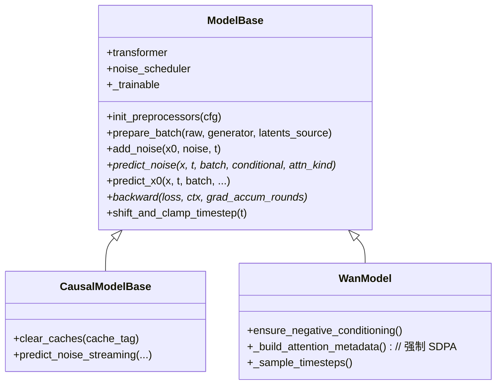
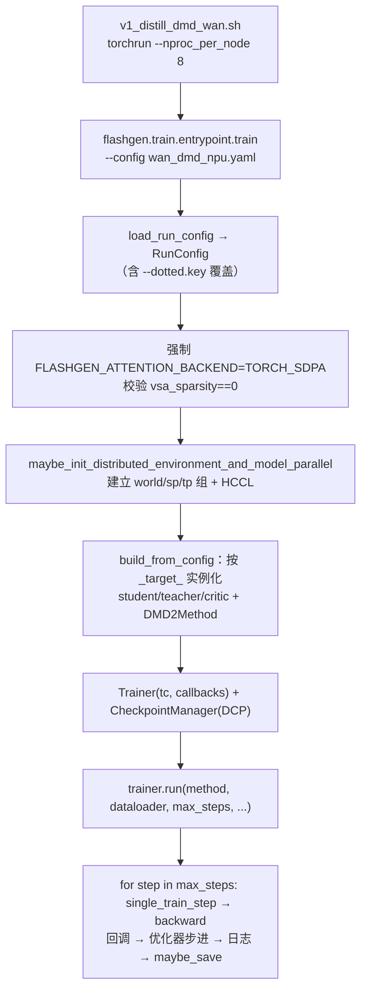
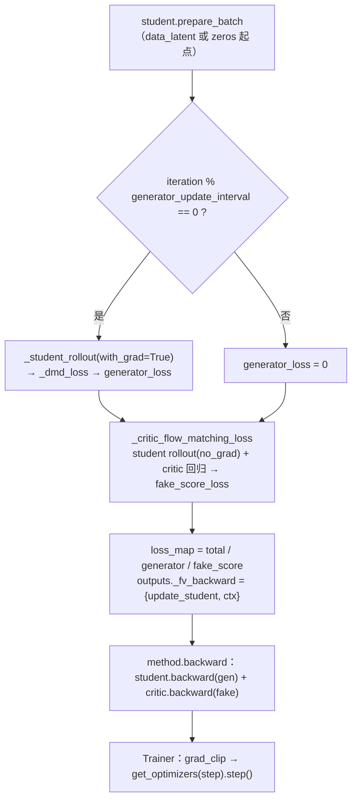
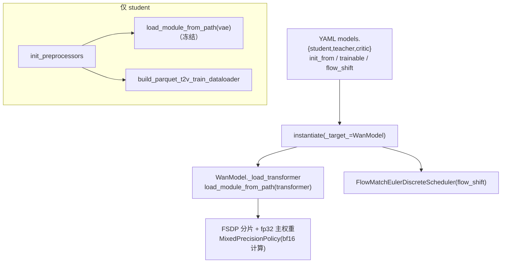
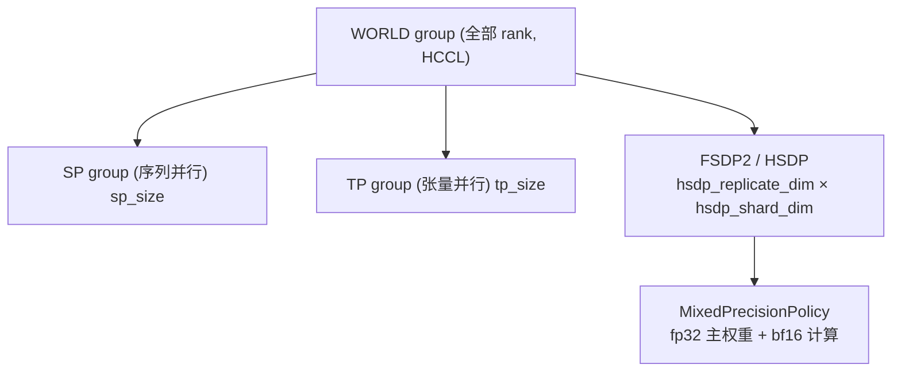
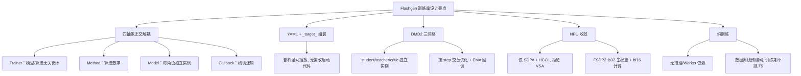

# Flashgen 架构设计文档（训练库 / Train-Only）

> 版本：基于当前代码库快照（Wan 2.1 1.3B DMD 步数蒸馏，NPU/昇腾专用分支）
> 文档定位：Flashgen 现已收敛为**只做训练的步数蒸馏算法库**——推理由其他库承担。训练栈已从旧的单体式 `flashgen/training/` 迁移到新的**模块化 YAML 驱动栈 `flashgen/train/`**。本文结合源码，系统讲解新栈的分层架构、训练生命周期、DMD 蒸馏数据流，以及拓展新蒸馏算法/新模型的扩展点。

---

## 1. 项目概述

**Flashgen** 是一个**面向 NPU（昇腾）的步数蒸馏（few-step distillation）训练库**。它不包含任何推理服务/CLI 生成/Worker 编排栈，只保留把多步扩散模型蒸馏成少步学生模型所需的训练能力。当前内置算法为 **DMD2（Distribution Matching Distillation，分布匹配蒸馏）**，目标模型族为 `Wan 2.1 1.3B` 文生视频（T2V）。

新栈 `flashgen/train/` 是从 FastVideo 新一代 `train/` 框架移植并做 NPU 适配的版本，核心思想是把「训练循环」「蒸馏算法」「模型」「横切关注点」四者彻底解耦，并用 YAML + `_target_` 组装。

设计上的几个硬约束（来自代码）：

| 维度 | 取值 | 代码依据 |
|------|------|----------|
| 库定位 | 仅训练，无推理 | `pipelines/__init__.py` 注释 "Train-only pipeline primitives" |
| 训练栈 | 模块化 YAML 驱动 | `train/entrypoint/train.py`（新）；旧 `training/` 仅保留共享工具 |
| 内置算法 | DMD2 三网络蒸馏 | `train/methods/distribution_matching/dmd2.py` |
| 目标模型 | Wan 2.1 1.3B T2V | `train/models/wan/wan.py::WanModel` |
| 目标硬件 | NPU（昇腾，HCCL 通信） | `platforms/npu.py` |
| 注意力后端 | 仅 `TORCH_SDPA` | `train/entrypoint/train.py` 强制、`platforms/npu.py::get_attn_backend_cls` |
| 蒸馏步数 | `[1000, 757, 522]`（默认 3 步） | `method.dmd_denoising_steps`（YAML） |
| DiT 主权重精度 | 训练 `fp32` 主权重 + bf16 计算 | YAML `training.dit_precision: fp32` + autocast |

一句话定位：

> **Flashgen（train-only）= YAML/`_target_` 组装 + 模型无关的 `Trainer` 训练循环 + 三网络 DMD2 交替优化 method + 每角色独立的 `WanModel` 实例 + NPU/FSDP 基础设施**，把预处理好的 latent/文本嵌入数据蒸馏成可少步推理的学生 DiT 权重。

---

## 2. 分层架构总览

新栈自顶向下分为 6 层：**启动层 → 组装层 → 训练循环层（Trainer）→ 算法层（Method）→ 模型层（每角色 Model 实例）→ 横切层（Callbacks）+ 共享基础设施**。与旧栈最大的区别是：

- 旧栈是一条 `TrainingPipeline → DistillationPipeline → WanDistillationPipeline` 继承链，一个 pipeline 对象**同时**持有 student/teacher/critic 三个 transformer 并内联整套训练循环。
- 新栈把「循环」抽到与模型/算法无关的 `Trainer`，把「算法」抽到 `TrainingMethod`，把「每个角色」抽成**独立的 `ModelBase` 实例**（student/teacher/critic 各是一个 `WanModel`），横切逻辑（梯度裁剪、EMA）放进 `Callback`。



**两个分离点（扩展时只动对应一层）**：

- **算法分离点（Method 层）**：所有算法都实现 `TrainingMethod` 接口。`算法1 = DMD2Method`（已实现）；要加新算法只需平级新建一个 `XxxMethod(TrainingMethod)`，实现 `single_train_step` / 优化器 / 损失，`Trainer` 循环无需改动。
- **模型分离点（Model 层）**：每个角色是一个独立的 `ModelBase` 实例。`Wan = WanModel`（已实现）；换目标模型只需平级新建一个 `YyyModel(ModelBase)`，实现 `prepare_batch` / `predict_noise` 等原语即可。

**核心思想**：启动层只决定「用哪个 YAML」；组装层按 `_target_` 反射实例化模型与算法；`Trainer` 提供与算法/模型无关的循环骨架；Method 只管算法数学；Model 只管单个角色的前向原语；Callbacks 承载横切逻辑；共享基础设施屏蔽 NPU/分布式/数据/checkpoint 细节。

---

## 3. 目录结构与职责

```text
flashgen/
├── train/                         # ★ 新训练栈（模块化 / YAML 驱动）
│   ├── trainer.py                    #   Trainer：模型/算法无关的训练循环
│   ├── entrypoint/
│   │   ├── train.py                  #   YAML 入口（torchrun -m flashgen.train.entrypoint.train）
│   │   └── dcp_to_diffusers.py       #   DCP checkpoint → diffusers 权重导出
│   ├── methods/
│   │   ├── base.py                   #   TrainingMethod ABC（算法层接口）
│   │   └── distribution_matching/
│   │       └── dmd2.py               #   DMD2Method（三网络 DMD 算法）
│   ├── models/
│   │   ├── base.py                   #   ModelBase / CausalModelBase（每角色模型接口）
│   │   └── wan/wan.py                #   WanModel（Wan 单角色实例）
│   ├── callbacks/
│   │   ├── callback.py               #   Callback 基类 + CallbackDict 分发器
│   │   ├── ema.py                    #   EMACallback（学生 EMA）
│   │   └── grad_clip.py              #   GradNormClipCallback（梯度裁剪）
│   └── utils/
│       ├── config.py                 #   load_run_config / RunConfig / 解析工具
│       ├── training_config.py        #   TrainingConfig 数据类（强类型配置）
│       ├── builder.py                #   build_from_config：按 _target_ 组装
│       ├── instantiate.py            #   instantiate / resolve_target（_target_ 机制）
│       ├── checkpoint.py             #   CheckpointManager / CheckpointConfig（DCP）
│       ├── moduleloader.py           #   load_module_from_path（transformer/vae 加载）
│       ├── dataloader.py             #   build_parquet_t2v_train_dataloader
│       ├── optimizer.py              #   build_optimizer_and_scheduler / clip_grad_norm
│       ├── lora.py                   #   LoraConfig / enable_lora_training
│       ├── module_state.py           #   apply_trainable（requires_grad 控制）
│       └── tracking.py               #   build_tracker（wandb/tensorboard）
├── training/                      # 旧栈：仅保留被新栈复用的共享工具
│   ├── training_utils.py             #   EMA_FSDP / sigmas / normalize / shift_timestep / clip
│   ├── checkpointing_utils.py        #   ModelWrapper / OptimizerWrapper / SchedulerWrapper
│   ├── activation_checkpoint.py      #   apply_activation_checkpointing
│   └── trackers.py                   #   Tracker 抽象
├── pipelines/                     # 训练用流水线原语
│   └── pipeline_batch_info.py        #   TrainingBatch（单步状态容器）
├── models/                        # 架构定义 + 加载器
│   ├── dits/wanvideo.py              #   WanTransformer3DModel
│   ├── vaes/wanvae.py                #   Wan VAE
│   ├── schedulers/                   #   FlowMatchEulerDiscreteScheduler（自带实现）
│   ├── loader/                       #   组件加载 + FSDP 分片 + 权重映射
│   └── utils.py                      #   pred_noise_to_pred_video 等
├── configs/                       # arch config + pipeline config
├── dataset/                       # parquet map-style dataloader（预处理 latents+嵌入）
├── distributed/                   # parallel_state + HCCL/NPU 通信器
├── platforms/                     # NPU 平台抽象（SDPA 后端）
├── layers/ / attention/ / hooks/  # 算子 / 注意力后端 / 激活追踪
└── flashgen_args.py               # FlashgenArgs / TrainingArgs（moduleloader 内部使用）
```

设计原则与跨栈规则：

- **`train/` 是唯一推荐的训练开发位置**；旧 `training/` 已进入维护模式，只保留 4 个被两栈共用的工具文件（`training_utils` / `checkpointing_utils` / `activation_checkpoint` / `trackers`）。旧的单体 pipeline（`training_pipeline.py` / `distillation_pipeline.py` / `wan_distillation_pipeline.py`）已删除。
- **禁止 `flashgen.train.*` 反向依赖 `flashgen.training.*` 的 pipeline 类**；只允许共享上述工具函数。
- **`train/methods/`**：一算法一类。加新算法在此平级新增。
- **`train/models/`**：一模型族一目录。加新模型在此平级新增。
- **YAML + `_target_`**：所有可插拔部件（模型、算法、回调）都在 YAML 里用 `_target_: 全限定类名` 声明，由 `instantiate` 反射构造，无需改启动代码。

---

## 4. 核心抽象

新栈的可维护性来自四个正交抽象：`Trainer`（循环）、`TrainingMethod`（算法）、`ModelBase`（角色模型）、`Callback`（横切）；外加 `TrainingBatch`（单步状态容器）。

### 4.1 四个抽象的职责边界

| 抽象 | 位置 | 职责 | 扩展时 |
|------|------|------|--------|
| `Trainer` | `train/trainer.py` | 梯度累积、回调分发、优化器/调度器步进、日志、checkpoint 触发；**与算法/模型完全无关** | 几乎不动 |
| `TrainingMethod` | `train/methods/base.py` | 持有各角色 `ModelBase`、构建优化器、定义 `single_train_step` 与损失、`backward` | 新算法平级新增子类 |
| `ModelBase` | `train/models/base.py` | 单个角色的 `transformer`+`noise_scheduler`、`prepare_batch`/`add_noise`/`predict_noise`/`predict_x0`/`backward` 原语 | 新模型平级新增子类 |
| `Callback` | `train/callbacks/callback.py` | 横切逻辑（梯度裁剪、EMA、验证），通过 hook 挂到循环各阶段 | 新增回调即插即用 |

### 4.2 TrainingMethod —— 算法层接口

`TrainingMethod` 是 `torch.nn.Module`，构造时接收 `role_models: dict[str, ModelBase]` 与 `cfg`。它把各角色的 transformer 收进 `role_modules`（供 FSDP/checkpoint 可见），并在 `on_train_start` 里创建**全局共享的设备 RNG 生成器**（`cuda_generator`，在 NPU 上实际建在 NPU 设备上）并做 SP 组一致的随机种子：

```251:271:flashgen/train/methods/base.py
    def on_train_start(self) -> None:
        from flashgen.distributed import (
            get_world_group, )
        from flashgen.utils import set_random_seed

        seed = self.training_config.data.seed
        if seed is None:
            raise ValueError("training.data.seed must be set")
        seed = int(seed)

        world_group = get_world_group()
        global_rank = int(world_group.rank)
        sp_size = int(self.training_config.distributed.sp_size or 1)

        # Ranks within the same SP group share a seed.
        sp_group_seed = seed + (global_rank // sp_size) if sp_size > 1 else seed + global_rank

        self.cuda_generator = torch.Generator(device=self.student.device).manual_seed(sp_group_seed)
        set_random_seed(sp_group_seed)

        self.student.on_train_start()
```

关键接口：`single_train_step`（返回 `loss_map / outputs / metrics`）、`backward`、`get_optimizers` / `get_lr_schedulers`（可随 step 变化）、`get_grad_clip_targets`、`checkpoint_state`（返回 `roles.<role>.<module>` / `optimizers.<role>` / `schedulers.<role>` 的 DCP 状态）。`manages_optimization()` 默认为 `False`——即由 `Trainer` 负责梯度累积与优化器步进；RL 类算法可返回 `True` 自管循环（FlashGen 当前不使用）。

### 4.3 ModelBase —— 每角色独立模型实例

与旧栈「一个 pipeline 持有三套 DiT」不同，新栈里 **student/teacher/critic 各是一个独立的 `ModelBase` 实例**，各自拥有 `transformer` 与 `noise_scheduler`。重量级资源（VAE、dataloader）只在 student 上通过 `init_preprocessors` 惰性加载：



`predict_x0` 在基类里由 `predict_noise` + `pred_noise_to_pred_video` 组合而成，因此模型子类只需实现 `predict_noise`。`CausalModelBase` 为流式/因果模型预留（FlashGen NPU 当前未使用）。

### 4.4 TrainingBatch —— 单步状态容器

`pipelines/pipeline_batch_info.py` 的 `TrainingBatch` 承载单步训练的全部中间张量，避免长参数列表。关键字段：`latents`、`noise` / `sigmas` / `timesteps`、`conditional_dict` / `unconditional_dict`（文本条件 / 负向嵌入）、`attn_metadata` / `attn_metadata_vsa`（NPU 下均为 `None`/dense）、`dmd_latent_vis_dict` / `fake_score_latent_vis_dict`（监控用）。

> 注意：train-only 下文本是**离线预编码**写入 parquet 的，因此训练期不加载 T5；`conditional_dict` 来自数据集，`unconditional_dict` 来自磁盘上的 `negative_prompt_embeds.pt`（缺失则零值回退）。

---

## 5. 训练启动与生命周期

### 5.1 从 torchrun 到训练循环



入口 `run_training_from_config` 是整个生命周期的关键，NPU 约束在这里强制生效：

```54:69:flashgen/train/entrypoint/train.py
    cfg = load_run_config(config_path, overrides=overrides)
    tc = cfg.training

    # FlashGen is the NPU-only FastVideo fork. Keep training on the only
    # supported attention backend instead of inheriting CUDA-only defaults.
    if tc.vsa_sparsity > 0.0:
        raise ValueError("FlashGen NPU training only supports FLASHGEN_ATTENTION_BACKEND=TORCH_SDPA; "
                         "set training.vsa.sparsity to 0.")
    os.environ.setdefault("FLASHGEN_ATTENTION_BACKEND", "TORCH_SDPA")

    maybe_init_distributed_environment_and_model_parallel(
        tc.distributed.tp_size,
        tc.distributed.sp_size,
    )

    _, method, dataloader, start_step = build_from_config(cfg)
```

### 5.2 组装：build_from_config

组装层是新栈的「装配车间」：按 `cfg.models` 里每个角色的 `_target_` 反射构造 `ModelBase` 实例，再按 `cfg.method["_target_"]` 构造 method 并注入这些角色模型；dataloader 由 student 提供：

```30:56:flashgen/train/utils/builder.py
    # --- 1. Build role model instances ---
    role_models: dict[str, ModelBase] = {}
    for role, model_cfg in cfg.models.items():
        model = instantiate(model_cfg, training_config=cfg.training)
        if not isinstance(model, ModelBase):
            raise TypeError(f"models.{role}._target_ must resolve to a "
                            f"ModelBase subclass, got {type(model).__name__}")
        role_models[role] = model

    # --- 2. Build method ---
    method_cfg = dict(cfg.method)
    method_target = str(method_cfg.pop("_target_"))
    method_cls = resolve_target(method_target)

    # The student model provides the dataloader.
    student = role_models.get("student")

    method = method_cls(
        cfg=cfg,
        role_models=role_models,
    )

    # --- 3. Gather dataloader and start_step ---
    dataloader = (getattr(student, "dataloader", None) if student is not None else None)
    start_step = int(getattr(student, "start_step", 0) if student is not None else 0)

    return cfg.training, method, dataloader, start_step
```

### 5.3 Trainer.run 主循环

`Trainer.run` 是模型/算法无关的循环骨架。默认路径（`manages_optimization()==False`）下，它负责：梯度累积、回调分发、优化器/调度器步进、单点 CPU 同步做日志、触发 checkpoint 与验证：

```152:234:flashgen/train/trainer.py
        for step in progress:
            t0 = time.perf_counter()

            # Accumulate on GPU during grad-accum; materialise
            # to CPU once per step right before logging.
            loss_sums: dict[str, float | torch.Tensor] = {}
            metric_sums: dict[str, float | torch.Tensor] = {}
            if method_manages_optimization:
                loss_map, outputs, step_metrics = method.managed_train_step(
                    data_stream,
                    step,
                )
                ...
            else:
                for accum_iter in range(grad_accum):
                    batch = next(data_stream)
                    loss_map, outputs, step_metrics = (method.single_train_step(
                        batch,
                        step,
                    ))

                    method.backward(
                        loss_map,
                        outputs,
                        grad_accum_rounds=grad_accum,
                    )
                    ...

            if not method_manages_optimization:
                self.callbacks.on_before_optimizer_step(
                    method,
                    iteration=step,
                )
                method.optimizers_schedulers_step(step)
                method.optimizers_zero_grad(step)
            ...
            self.callbacks.on_training_step_end(
                method,
                metrics,
                iteration=step,
            )

            if checkpoint_manager is not None:
                checkpoint_manager.maybe_save(step)
```

一次训练的完整 hook 时序：`method.on_train_start`（建 RNG / 加载负向嵌入）→ `callbacks.on_train_start`（建 EMA）→ 断点续训 → 每步 `single_train_step` × grad_accum → `callbacks.on_before_optimizer_step`（梯度裁剪）→ 优化器步进 → `callbacks.on_training_step_end`（EMA 更新 + 日志）→ `maybe_save` → 结束时 `on_train_end` + `save_final`。

---

## 6. 训练流程（DMD2）

`Trainer` 只管「怎么循环」，`DMD2Method` 只管「一步里算什么」。DMD2 的三网络分工、学生 rollout、DMD 损失与 flow-matching 损失的**数学细节**见《[DMD 蒸馏算法实现](DMD蒸馏算法实现.md)》，此处只讲流程编排。

### 6.1 单步 single_train_step（generator / critic 交替）

一步里 critic **每步**更新，student（generator）**每 `generator_update_interval` 步**才更新一次；两者的 backward 被打包进 `outputs["_fv_backward"]` 交给 method 自己的 `backward` 按角色分别回传：



```82:137:flashgen/train/methods/distribution_matching/dmd2.py
    def single_train_step(
        self,
        batch: dict[str, Any],
        iteration: int,
    ) -> tuple[
            dict[str, torch.Tensor],
            dict[str, Any],
            dict[str, LogScalar],
    ]:
        latents_source: Literal["data", "zeros"] = "data"
        if self._rollout_mode == "simulate":
            latents_source = "zeros"

        training_batch = self.student.prepare_batch(
            batch,
            generator=self.cuda_generator,
            latents_source=latents_source,
        )

        update_student = self._should_update_student(iteration)

        generator_loss = torch.zeros(
            (),
            device=training_batch.latents.device,
            dtype=training_batch.latents.dtype,
        )
        student_ctx = None
        if update_student:
            generator_pred_x0 = self._student_rollout(training_batch, with_grad=True)
            student_ctx = (
                training_batch.timesteps,
                training_batch.attn_metadata_vsa,
            )
            generator_loss = self._dmd_loss(generator_pred_x0, training_batch)

        (
            fake_score_loss,
            critic_ctx,
            critic_outputs,
        ) = self._critic_flow_matching_loss(training_batch)

        total_loss = generator_loss + fake_score_loss
        loss_map = {
            "total_loss": total_loss,
            "generator_loss": generator_loss,
            "fake_score_loss": fake_score_loss,
        }

        outputs: dict[str, Any] = dict(critic_outputs)
        outputs["_fv_backward"] = {
            "update_student": update_student,
            "student_ctx": student_ctx,
            "critic_ctx": critic_ctx,
        }
        metrics: dict[str, LogScalar] = {"update_student": float(update_student)}
        return loss_map, outputs, metrics
```

`get_optimizers` / `get_lr_schedulers` / `get_grad_clip_targets` 都会根据 `_should_update_student(step)` 动态返回：critic 恒在列，student 仅在更新步纳入。这样非更新步只推进 critic，天然实现「critic 追分布、generator 间歇更新」的交替节奏。

### 6.2 rollout 模式

`method.rollout_mode` 决定学生如何产生 `pred_x0`：

- `data_latent`（默认）：从预处理 VAE latent 出发，在采样到的去噪步加噪后让学生单步预测 `x0`。需要 `preprocessed_data_type=t2v`。
- `simulate`：从纯噪声出发，学生**逐步**走到随机目标步（中间步在 `no_grad` 下预测→加噪循环），仅目标步带梯度。可配 `text_only` 数据。

---

## 7. 模型与组件加载

模型子类不直接 `import` DiT/VAE 类，而是通过 `train/utils/moduleloader.py::load_module_from_path` 复用 flashgen 的 `PipelineComponentLoader`，按 diffusers `model_index.json` 动态加载并走 FSDP 分片。student/teacher/critic 三个 `WanModel` 各自独立调用同一加载路径：



- **每角色独立实例**：`trainable=false` 的 teacher 通过 `apply_trainable` 冻结（`requires_grad_(False)`）；student/critic 可训练。三者结构一致但权重与梯度独立。
- **精度策略**：DiT 以 **fp32 主权重**加载，由 FSDP2 `MixedPrecisionPolicy` 控制前向/反向用 bf16（`WanModel.predict_noise` 内 `torch.autocast(bf16)`）。VAE 冻结，仅用于可选中间 latent 可视化/解码。
- **NPU 注意力**：`WanModel._build_attention_metadata` 强制校验后端为 `TORCH_SDPA`、拒绝 VSA，并把 `attn_metadata` 置 `None`（dense 路径）；不引入任何 CUDA-only 稀疏注意力 kernel。

---

## 8. 配置体系

### 8.1 YAML + `_target_` 组装

一份 run YAML 分为 `models` / `method` / `training` / `pipeline` / `callbacks` 五大块，可插拔部件用 `_target_` 声明全限定类名，由 `instantiate` 反射构造。以 `scripts/distill/wan_dmd_npu.yaml` 为例：

```3:31:scripts/distill/wan_dmd_npu.yaml
models:
  student:
    _target_: flashgen.train.models.wan.wan.WanModel
    init_from: Wan-AI/Wan2.1-T2V-1.3B-Diffusers
    trainable: true
    flow_shift: 8.0
  teacher:
    _target_: flashgen.train.models.wan.wan.WanModel
    init_from: Wan-AI/Wan2.1-T2V-1.3B-Diffusers
    trainable: false
    disable_custom_init_weights: true
    flow_shift: 8.0
  critic:
    _target_: flashgen.train.models.wan.wan.WanModel
    init_from: Wan-AI/Wan2.1-T2V-1.3B-Diffusers
    trainable: true
    disable_custom_init_weights: true
    flow_shift: 8.0

method:
  _target_: flashgen.train.methods.distribution_matching.dmd2.DMD2Method
  rollout_mode: data_latent
  generator_update_interval: 5
  dmd_denoising_steps: [1000, 757, 522]
  warp_denoising_step: false
  real_score_guidance_scale: 3.5
  fake_score_learning_rate: 0.0
  fake_score_lr_scheduler: constant
  fake_score_betas: [0.9, 0.999]
```

### 8.2 各配置块职责

| 配置块 | 归属类型 | 关键字段 |
|--------|----------|----------|
| `models.<role>` | 每角色 `ModelBase` 构造参数 | `_target_`、`init_from`、`trainable`、`flow_shift`、`lora` |
| `method` | 算法超参（`DMD2Method`） | `rollout_mode`、`generator_update_interval`、`dmd_denoising_steps`、`real_score_guidance_scale`、`fake_score_*` |
| `training` | 强类型 `TrainingConfig` | `distributed`（sp/tp/hsdp）、`data`（seed/尺寸/cfg_rate）、`optimizer`、`loop`（max_steps/grad_accum）、`checkpoint`、`tracker`、`model`（weighting/timestep_ratio）、`vsa` |
| `pipeline` | pipeline_config | `flow_shift`、`dit_precision`、`vae_precision`、`dmd_denoising_steps` |
| `callbacks` | 横切回调 | `grad_clip.max_grad_norm`、`ema.decay`/`start_iter` |

- **critic 优化器回退**：`method.fake_score_learning_rate/betas/lr_scheduler` 若为 0/未设，回退到 `training.optimizer` 的对应值（`dmd2.py::_init_optimizers_and_schedulers`）。这是 FlashGen 刻意保留、区别于上游的行为。
- **时间步范围**：`training.model.min/max_timestep_ratio` × `num_train_timesteps` 决定 `WanModel` 的 clamp 区间；`shift_and_clamp_timestep` 再做 flow-shift 变换。

---

## 9. 分布式、平台、数据与 Checkpoint

### 9.1 并行与 FSDP



- `maybe_init_distributed_environment_and_model_parallel(tp_size, sp_size)` 在入口幂等建组。
- 训练用 **HSDP**（`hsdp_replicate_dim` × `hsdp_shard_dim`）做参数分片 + 复制。
- 采样时间步在 SP 组内 `broadcast(src=0)` 保持一致（`WanModel._prepare_dit_inputs`）；RNG 用 method 的共享 `cuda_generator`，SP 组内同种子。

### 9.2 NPU 平台与注意力

```66:74:flashgen/platforms/npu.py
    @classmethod
    def get_attn_backend_cls(cls, selected_backend, head_size, dtype) -> str:
        logger.info("Trying FLASHGEN_ATTENTION_BACKEND=%s", envs.FLASHGEN_ATTENTION_BACKEND)
        if envs.FLASHGEN_ATTENTION_BACKEND != "TORCH_SDPA":
            logger.info("Ascend NPU only supports the Torch SDPA backend.")
        else:
            logger.info("Using Torch SDPA backend.")
        return "flashgen.attention.backends.sdpa.SDPABackend"
```

- 分布式后端用 **HCCL**；设备可见性通过 `ASCEND_RT_VISIBLE_DEVICES` 控制。
- 注意力只保留 SDPA 一条路径；入口与 `WanModel` 双重强制 `TORCH_SDPA` 且 `vsa_sparsity==0`。

### 9.3 数据与 Checkpoint

- **数据**：`build_parquet_t2v_train_dataloader` 读取**预处理 parquet**（已含 latent + 文本嵌入），按 `pyarrow_schema_t2v` 解析，`training_cfg_rate` 控制条件丢弃做 CFG 训练。
- **负向嵌入**：`WanModel.ensure_negative_conditioning` 从 `negative_prompt_embeds_path`（或 `model_path/negative_prompt_embeds`）加载 `.pt`，缺失则零值回退（`_prepare_dit_inputs` 里 `torch.zeros_like`）。
- **Checkpoint（DCP）**：`CheckpointManager`（`train/utils/checkpoint.py`）用 `torch.distributed.checkpoint` 存取。`method.checkpoint_state()` 汇集所有可训练角色的 `roles.<role>.transformer` / `optimizers.<role>` / `schedulers.<role>`；EMA 状态由 `EMACallback` 单独存取；RNG 快照按 rank 保存 `npu_rng`/`gen_device`（兼容旧 `cuda_rng`）。`maybe_save` / `save_final` / `maybe_resume` / `load_rng_snapshot` 支持断点续训。

---

## 10. 扩展点

新栈的四抽象正交，扩展只动对应一层：

| 想做的事 | 改动位置 |
|----------|----------|
| **新增一种蒸馏算法**（CM/LADD/其他） | 在 `train/methods/` 平级新建 `XxxMethod(TrainingMethod)`，实现 `single_train_step` / 优化器 / 损失；`Trainer` 无需改动，YAML `method._target_` 指向它 |
| **换/加目标模型**（非 Wan） | 在 `train/models/` 平级新建 `YyyModel(ModelBase)`，实现 `prepare_batch` / `predict_noise` 等原语；YAML `models.<role>._target_` 指向它 |
| **新增横切逻辑**（新监控/正则） | 在 `train/callbacks/` 新建 `Callback` 子类，挂需要的 hook；YAML `callbacks.<name>._target_` 声明 |
| 调整蒸馏步数 / flow_shift / CFG | 改 YAML `method.dmd_denoising_steps` / `flow_shift` / `real_score_guidance_scale` |
| 改时间步采样/范围 | `training.model.weighting_scheme` / `min/max_timestep_ratio` |
| 改权重加载/精度 | `train/utils/moduleloader.py` + arch config 的 `param_names_mapping` |
| LoRA 训练 | YAML `models.<role>.lora`（`enable/rank/alpha/target_modules`） |

设计亮点：



### 一句话架构

> **Flashgen（train-only）= YAML/`_target_` 组装 → 模型无关的 `Trainer` 循环 → `DMD2Method` 三网络交替优化 → student/teacher/critic 三个独立 `WanModel` 实例 + `Callback` 横切 + NPU/FSDP 基础设施**，把预处理数据蒸馏成可少步推理的学生 DiT 权重；推理交由其他库完成。

---

*本文档基于源码静态分析生成，关键代码位置均以 `路径:行号` 标注，便于对照查阅。*
